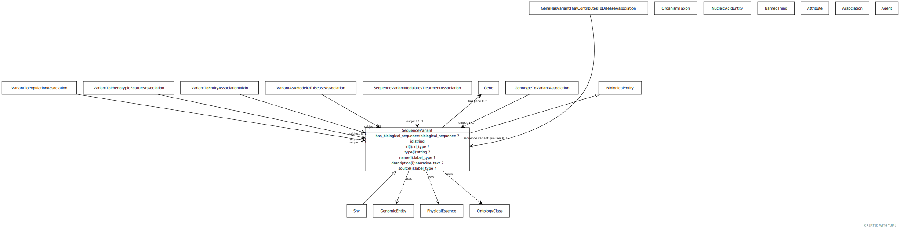

# Type: sequence variant

An allele that varies in its sequence from what is considered the reference allele at that locus.

URI: [biolink:SequenceVariant](https://w3id.org/biolink/vocab/SequenceVariant)

## Parents

 *  is_a: [GenomicEntity](GenomicEntity.md) - an entity that can either be directly located on a genome (gene, transcript, exon, regulatory region) or is encoded in a genome (protein)

## Children

 * [Snv](Snv.md) - SNVs are single nucleotide positions in genomic DNA at which different sequence alternatives exist

## Referenced by class

 *  **[GenotypeToVariantAssociation](GenotypeToVariantAssociation.md)** *[genotype to variant association➞object](genotype_to_variant_association_object.md)*  REQ  **[SequenceVariant](SequenceVariant.md)**
 *  **[SequenceVariantModulatesTreatmentAssociation](SequenceVariantModulatesTreatmentAssociation.md)** *[sequence variant modulates treatment association➞subject](sequence_variant_modulates_treatment_association_subject.md)*  REQ  **[SequenceVariant](SequenceVariant.md)**
 *  **[Association](Association.md)** *[sequence variant qualifier](sequence_variant_qualifier.md)*  OPT  **[SequenceVariant](SequenceVariant.md)**
 *  **[VariantAsAModelOfDiseaseAssociation](VariantAsAModelOfDiseaseAssociation.md)** *[variant as a model of disease association➞subject](variant_as_a_model_of_disease_association_subject.md)*  REQ  **[SequenceVariant](SequenceVariant.md)**
 *  **[VariantToPhenotypicFeatureAssociation](VariantToPhenotypicFeatureAssociation.md)** *[variant to phenotypic feature association➞subject](variant_to_phenotypic_feature_association_subject.md)*  REQ  **[SequenceVariant](SequenceVariant.md)**
 *  **[VariantToPopulationAssociation](VariantToPopulationAssociation.md)** *[variant to population association➞subject](variant_to_population_association_subject.md)*  REQ  **[SequenceVariant](SequenceVariant.md)**
 *  **[VariantToThingAssociation](VariantToThingAssociation.md)** *[variant to thing association➞subject](variant_to_thing_association_subject.md)*  REQ  **[SequenceVariant](SequenceVariant.md)**

## Attributes

### Own

 * [sequence variant➞has biological sequence](sequence_variant_has_biological_sequence.md)  OPT
    * Description: The state of the sequence w.r.t a reference sequence
    * range: [BiologicalSequence](types/BiologicalSequence.md)
 * [sequence variant➞has gene](sequence_variant_has_gene.md)  0..*
    * Description: Each allele can be associated with any number of genes
    * range: [Gene](Gene.md)
 * [sequence variant➞id](sequence_variant_id.md)  REQ
    * range: [String](types/String.md)
    * Example:    
    * Example:    

### Inherited from genomic entity:

 * [category](category.md)  1..*
    * Description: Name of the high level ontology class in which this entity is categorized. Corresponds to the label for the biolink entity type class. In a neo4j database this MAY correspond to the neo4j label tag
    * range: [CategoryType](types/CategoryType.md)
    * in subsets: (translator_minimal)
 * [name](name.md)  REQ
    * Description: A human-readable name for a thing
    * range: [LabelType](types/LabelType.md)
    * in subsets: (translator_minimal)

## Other properties

|  |  |  |
| --- | --- | --- |
| **Aliases:** | | allele |
| **Local names:** | | allele (agr) |
| **Mappings:** | | GENO:0000002 |
|  | | WIKIDATA:Q15304597 |
|  | | SIO:010277 |
|  | | VMC:Allele |
|  | | SO:0001059 |
|  | | SO:0001060 |
| **Alt Descriptions:** | | An enitity that describes a single affected, endogenous allele.  These can be of any type that matches that definition (AGR) |
|  | | A contiguous change at a Location (VMC) |
| **Comments:** | | This class is for modeling the specific state at a locus. A single dbSNP rs ID could correspond to more than one sequence variants (e.g CIViC:1252 and CIViC:1253, two distinct BRCA2 alleles for rs28897743) |

