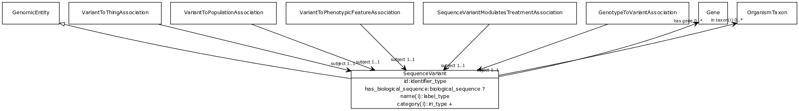

# Class: sequence variant

An allele that varies in its sequence from what is considered the reference allele at that locus.

URI: [biolink:SequenceVariant](https://w3id.org/biolink/vocab/SequenceVariant)

## Parents

 *  is_a: [GenomicEntity](GenomicEntity.md) - an entity that can either be directly located on a genome (gene, transcript, exon, regulatory region) or is encoded in a genome (protein)

## Referenced by class

 *  **[GenotypeToVariantAssociation](GenotypeToVariantAssociation.md)** *[object](genotype_to_variant_association_object.md)*  REQ  **[SequenceVariant](SequenceVariant.md)**
 *  **[SequenceVariantModulatesTreatmentAssociation](SequenceVariantModulatesTreatmentAssociation.md)** *[subject](sequence_variant_modulates_treatment_association_subject.md)*  REQ  **[SequenceVariant](SequenceVariant.md)**
 *  **[Association](Association.md)** *[sequence variant qualifier](sequence_variant_qualifier.md)*  OPT  **[SequenceVariant](SequenceVariant.md)**
 *  **[VariantToPhenotypicFeatureAssociation](VariantToPhenotypicFeatureAssociation.md)** *[subject](variant_to_phenotypic_feature_association_subject.md)*  REQ  **[SequenceVariant](SequenceVariant.md)**
 *  **[VariantToPopulationAssociation](VariantToPopulationAssociation.md)** *[subject](variant_to_population_association_subject.md)*  REQ  **[SequenceVariant](SequenceVariant.md)**
 *  **[VariantToThingAssociation](VariantToThingAssociation.md)** *[subject](variant_to_thing_association_subject.md)*  REQ  **[SequenceVariant](SequenceVariant.md)**

## Attributes

### Own

 * [has biological sequence](sequence_variant_has_biological_sequence.md)  OPT
    * range: [BiologicalSequence](BiologicalSequence.md)
 * [has gene](sequence_variant_has_gene.md)  0..*
    * range: [Gene](Gene.md)
 * [id](sequence_variant_id.md)  REQ
    * range: [IdentifierType](IdentifierType.md)

### Inherited from named thing:

 * [id](id.md)  REQ
    * Description: A unique identifier for a thing. Must be either a CURIE shorthand for a URI or a complete URI
    * range: [IdentifierType](IdentifierType.md)
    * inherited from: [NamedThing](NamedThing.md)
    * in subsets: (translator_minimal)
 * [name](name.md)  REQ
    * Description: A human-readable name for a thing
    * range: [LabelType](LabelType.md)
    * inherited from: [NamedThing](NamedThing.md)
    * in subsets: (translator_minimal)
 * [category](category.md)  1..*
    * Description: Name of the high level ontology class in which this entity is categorized. Corresponds to the label for the biolink entity type class. In a neo4j database this MAY correspond to the neo4j label tag
    * range: [IriType](IriType.md)
    * inherited from: [NamedThing](NamedThing.md)
    * in subsets: (translator_minimal)

### Inherited from thing with taxon:

 * [in taxon](in_taxon.md)  0..*
    * Description: connects a thing to a class representing a taxon
    * range: [OrganismTaxon](OrganismTaxon.md)
    * inherited from: [ThingWithTaxon](ThingWithTaxon.md)
    * in subsets: (translator_minimal)

### Domain for slot:

 * [has biological sequence](sequence_variant_has_biological_sequence.md)  OPT
    * range: [BiologicalSequence](BiologicalSequence.md)
 * [has gene](sequence_variant_has_gene.md)  0..*
    * range: [Gene](Gene.md)
 * [id](sequence_variant_id.md)  REQ
    * range: [IdentifierType](IdentifierType.md)
