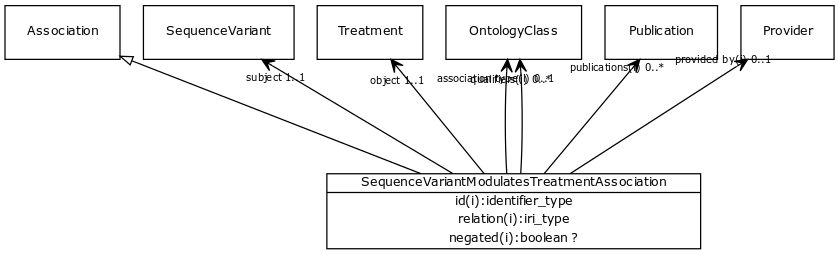

# Class: sequence variant modulates treatment association

An association between a sequence variant and a treatment or health intervention. The treatment object itself encompasses both the disease and the drug used.

URI: [http://w3id.org/biolink/vocab/SequenceVariantModulatesTreatmentAssociation](http://w3id.org/biolink/vocab/SequenceVariantModulatesTreatmentAssociation)

## Mappings

## Inheritance

 *  is_a: [Association](Association.md) - A typed association between two entities, supported by evidence
## Children

## Used in

## Fields

 * [sequence variant modulates treatment association.object](sequence_variant_modulates_treatment_association_object.md)
    * Description: treatment whose efficacy is modulated by the subject variant
    * range: [Treatment](Treatment.md) [required]
    * __Local__
 * [sequence variant modulates treatment association.subject](sequence_variant_modulates_treatment_association_subject.md)
    * Description: variant that modulates the treatment of some disease
    * range: [SequenceVariant](SequenceVariant.md) [required]
    * __Local__
 * [association slot](association_slot.md)
    * Description: any slot that relates an association to another entity
    * range: **string**
    * inherited from: [Association](Association.md)
 * [association type](association_type.md)
    * Description: connects an association to the type of association (e.g. gene to phenotype)
    * range: [OntologyClass](OntologyClass.md)
    * inherited from: [Association](Association.md)
 * [association.id](association_id.md) *subsets*: (translator_minimal)
    * Description: A unique identifier for an association
    * range: [IdentifierType](IdentifierType.md)
    * inherited from: [Association](Association.md)
 * [negated](negated.md)
    * Description: if set to true, then the association is negated i.e. is not true
    * range: **boolean**
    * inherited from: [Association](Association.md)
 * [provided by](provided_by.md)
    * Description: connects an association to the agent (person, organization or group) that provided it
    * range: [Provider](Provider.md)
    * inherited from: [Association](Association.md)
 * [publications](publications.md)
    * Description: connects an association to publications supporting the association
    * range: [Publication](Publication.md)*
    * inherited from: [Association](Association.md)
 * [qualifiers](qualifiers.md)
    * Description: connects an association to qualifiers that modify or qualify the meaning of that association
    * range: [OntologyClass](OntologyClass.md)*
    * inherited from: [Association](Association.md)
 * [relation](relation.md)
    * Description: the relationship type by which a subject is connected to an object in an association
    * range: [IriType](IriType.md) [required]
    * inherited from: [Association](Association.md)
