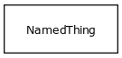

# Class: severity value

describes the severity of a phenotypic feature or disease

URI: [http://bioentity.io/vocab/SeverityValue](http://bioentity.io/vocab/SeverityValue)

## Mappings

## Inheritance

 *  is_a: [Attribute](Attribute.md) - A property or characteristic of an entity
## Children

## Used in

 *  class: **[EntityToPhenotypicFeatureAssociation](EntityToPhenotypicFeatureAssociation.md)** *[severity qualifier](severity_qualifier.md)* **[SeverityValue](SeverityValue.md)**
## Fields

 * _[subclass of](subclass_of.md) *subsets*: (translator_minimal)_
    * _holds between two classes where the domain class is a specialization of the range class_
    * range: [OntologyClass](OntologyClass.md)
    * inherited from: [OntologyClass](OntologyClass.md)
