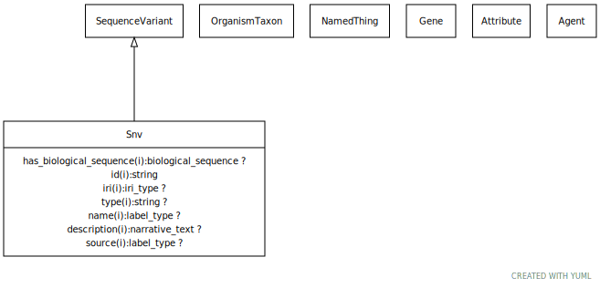

# Type: snv

SNVs are single nucleotide positions in genomic DNA at which different sequence alternatives exist

URI: [biolink:Snv](https://w3id.org/biolink/vocab/Snv)

## Parents

 *  is_a: [SequenceVariant](SequenceVariant.md) - An allele that varies in its sequence from what is considered the reference allele at that locus.

## Attributes

### Inherited from sequence variant:

 * [category](category.md)  1..*
    * Description: Name of the high level ontology class in which this entity is categorized. Corresponds to the label for the biolink entity type class. In a neo4j database this MAY correspond to the neo4j label tag
    * range: [CategoryType](types/CategoryType.md)
    * in subsets: (translator_minimal)
 * [name](name.md)  REQ
    * Description: A human-readable name for a thing
    * range: [LabelType](types/LabelType.md)
    * in subsets: (translator_minimal)
 * [sequence variant➞has biological sequence](sequence_variant_has_biological_sequence.md)  OPT
    * Description: The state of the sequence w.r.t a reference sequence
    * range: [BiologicalSequence](types/BiologicalSequence.md)
 * [sequence variant➞has gene](sequence_variant_has_gene.md)  0..*
    * Description: Each allele can be associated with any number of genes
    * range: [Gene](Gene.md)
 * [sequence variant➞id](sequence_variant_id.md)  REQ
    * range: [String](types/String.md)
    * Example:    
    * Example:    

## Other properties

|  |  |  |
| --- | --- | --- |
| **Aliases:** | | single nucleotide variant |
| **Mappings:** | | SO:0001483 |

