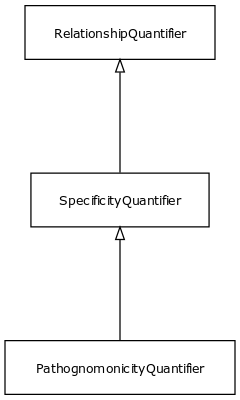

# Class: specificity quantifier

URI: [http://bioentity.io/vocab/SpecificityQuantifier](http://bioentity.io/vocab/SpecificityQuantifier)

## Mappings

## Inheritance

 *  is_a: [RelationshipQuantifier](RelationshipQuantifier.md)
## Children

 * [PathognomonicityQuantifier](PathognomonicityQuantifier.md) - A relationship quantifier between a variant or symptom and a disease, which is high when the presence of the feature implies the existence of the disease
## Used in

## Fields

