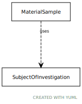

# Type: subject of investigation

An entity that has the role of being studied in an investigation, study, or experiment

URI: [biolink:SubjectOfInvestigation](https://w3id.org/biolink/vocab/SubjectOfInvestigation)

## Mixin for

 * [MaterialSample](MaterialSample.md) (mixin)  - A sample is a limited quantity of something (e.g. an individual or set of individuals from a population, or a portion of a substance) to be used for testing, analysis, inspection, investigation, demonstration, or trial use. [SIO]

## Referenced by class

## Attributes

