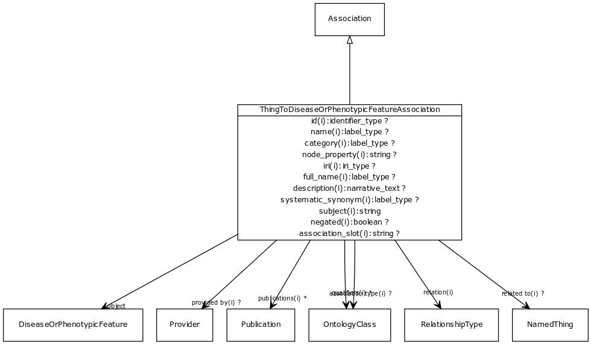

# Class: thing to disease or phenotypic feature association

URI: [http://w3id.org/biolink/vocab/ThingToDiseaseOrPhenotypicFeatureAssociation](http://w3id.org/biolink/vocab/ThingToDiseaseOrPhenotypicFeatureAssociation)

## Mappings

## Inheritance

 *  is_a: [Association](Association.md) - A typed association between two entities, supported by evidence
## Children

 * [BiosampleToDiseaseOrPhenotypicFeatureAssociation](BiosampleToDiseaseOrPhenotypicFeatureAssociation.md) (mixin)  - An association between a biosample and a disease or phenotype
 * [CellLineToDiseaseOrPhenotypicFeatureAssociation](CellLineToDiseaseOrPhenotypicFeatureAssociation.md) (mixin)  - An relationship between a cell line and a disease or a phenotype, where the cell line is derived from an individual with that disease or phenotype
 * [ChemicalToDiseaseOrPhenotypicFeatureAssociation](ChemicalToDiseaseOrPhenotypicFeatureAssociation.md) (mixin)  - An interaction between a chemical entity and a phenotype or disease, where the presence of the chemical gives rise to or exacerbates the phenotype
## Used in

## Fields

 * [thing to disease or phenotypic feature association.object](thing_to_disease_or_phenotypic_feature_association_object.md)
    * Description: disease or phenotype
    * range: [DiseaseOrPhenotypicFeature](DiseaseOrPhenotypicFeature.md) [required]
    * __Local__
 * [association slot](association_slot.md)
    * Description: any slot that relates an association to another entity
    * range: **string**
    * inherited from: [Association](Association.md)
 * [association type](association_type.md)
    * Description: connects an association to the type of association (e.g. gene to phenotype)
    * range: [OntologyClass](OntologyClass.md)
    * inherited from: [Association](Association.md)
 * [association.id](association_id.md) *subsets*: (translator_minimal)
    * Description: A unique identifier for an association
    * range: [IdentifierType](IdentifierType.md)
    * inherited from: [Association](Association.md)
 * [negated](negated.md)
    * Description: if set to true, then the association is negated i.e. is not true
    * range: **boolean**
    * inherited from: [Association](Association.md)
 * [provided by](provided_by.md)
    * Description: connects an association to the agent (person, organization or group) that provided it
    * range: [Provider](Provider.md)
    * inherited from: [Association](Association.md)
 * [publications](publications.md)
    * Description: connects an association to publications supporting the association
    * range: [Publication](Publication.md)*
    * inherited from: [Association](Association.md)
 * [qualifiers](qualifiers.md)
    * Description: connects an association to qualifiers that modify or qualify the meaning of that association
    * range: [OntologyClass](OntologyClass.md)*
    * inherited from: [Association](Association.md)
 * [relation](relation.md)
    * Description: the relationship type by which a subject is connected to an object in an association
    * range: [IriType](IriType.md) [required]
    * inherited from: [Association](Association.md)
 * [subject](subject.md)
    * Description: connects an association to the subject of the association. For example, in a gene-to-phenotype association, the gene is subject and phenotype is object.
    * range: [IriType](IriType.md) [required]
    * inherited from: [Association](Association.md)
