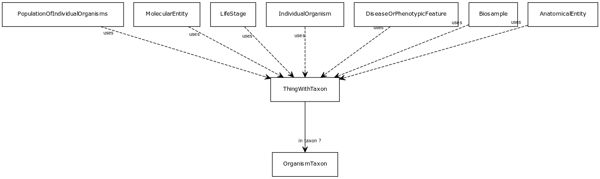

# Class: thing with taxon

A mixin that can be used on any entity with a taxon

URI: [http://w3id.org/biolink/vocab/ThingWithTaxon](http://w3id.org/biolink/vocab/ThingWithTaxon)

## Mappings

## Inheritance

## Children

 * [AnatomicalEntity](AnatomicalEntity.md) (mixin)  - A subcellular location, cell type or gross anatomical part
 * [Biosample](Biosample.md) (mixin) 
 * [DiseaseOrPhenotypicFeature](DiseaseOrPhenotypicFeature.md) (mixin)  - Either one of a disease or an individual phenotypic feature. Some knowledge resources such as Monarch treat these as distinct, others such as MESH conflate.
 * [IndividualOrganism](IndividualOrganism.md) (mixin) 
 * [LifeStage](LifeStage.md) (mixin)  - A stage of development or growth of an organism, including post-natal adult stages
 * [MolecularEntity](MolecularEntity.md) (mixin)  - A gene, gene product, small molecule or macromolecule (including protein complex)
 * [PopulationOfIndividualOrganisms](PopulationOfIndividualOrganisms.md) (mixin)  - A collection of individuals from the same taxonomic class distinguished by one or more characteristics. Characteristics can include, but are not limited to, shared geographic location, genetics, phenotypes [Alliance for Genome Resources]  
## Used in

## Fields

 * [in taxon](in_taxon.md) *subsets*: (translator_minimal)
    * Description: connects a thing to a class representing a taxon
    * range: [OrganismTaxon](OrganismTaxon.md)
    * __Local__
