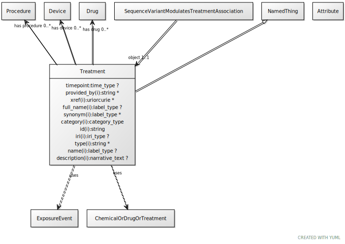

# Type: treatment

A treatment is targeted at a disease or phenotype and may involve multiple drug 'exposures'

URI: [biolink:Treatment](https://w3id.org/biolink/vocab/Treatment)

## Parents

 *  is_a: [ExposureEvent](ExposureEvent.md) - A feature of the environment of an organism that influences one or more phenotypic features of that organism, potentially mediated by genes

## Referenced by class

 *  **[SequenceVariantModulatesTreatmentAssociation](SequenceVariantModulatesTreatmentAssociation.md)** *[sequence variant modulates treatment association➞object](sequence_variant_modulates_treatment_association_object.md)*  REQ  **[Treatment](Treatment.md)**

## Attributes

### Own

 * [treatment➞has part](treatment_has_part.md)  1..*
    * range: [DrugExposure](DrugExposure.md)

### Inherited from exposure event:

 * [category](category.md)  1..*
    * Description: Name of the high level ontology class in which this entity is categorized. Corresponds to the label for the biolink entity type class. In a neo4j database this MAY correspond to the neo4j label tag
    * range: [CategoryType](types/CategoryType.md)
    * in subsets: (translator_minimal)
 * [id](id.md)  REQ
    * Description: A unique identifier for a thing. Must be either a CURIE shorthand for a URI or a complete URI
    * range: [String](types/String.md)
    * in subsets: (translator_minimal)
 * [name](name.md)  REQ
    * Description: A human-readable name for a thing
    * range: [LabelType](types/LabelType.md)
    * in subsets: (translator_minimal)

## Other properties

|  |  |  |
| --- | --- | --- |
| **Aliases:** | | medical action |
| **Mappings:** | | OGMS:0000090 |
|  | | SIO:001398 |

