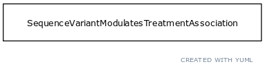

# Class: treatment

A treatment is targeted at a disease or phenotype and may involve multiple drug 'exposures'

URI: [http://w3id.org/biolink/vocab/Treatment](http://w3id.org/biolink/vocab/Treatment)

## Mappings

 * [OGMS:0000090](http://purl.obolibrary.org/obo/OGMS_0000090)
 * [SIO:001398](http://semanticscience.org/resource/SIO_001398)
## Inheritance

 *  is_a: [Environment](Environment.md) - A feature of the environment of an organism that influences one or more phenotypic features of that organism, potentially mediated by genes
## Children

## Used in

 *  class: **[SequenceVariantModulatesTreatmentAssociation](SequenceVariantModulatesTreatmentAssociation.md)** *[sequence variant modulates treatment association.object](sequence_variant_modulates_treatment_association_object.md)* **[Treatment](Treatment.md)**
## Fields

 * [treatment.has exposure parts](has_exposure_parts.md)
    * range: [DrugExposure](DrugExposure.md)* [required]
    * __Local__
 * [treats](treats.md) *subsets*: (translator_minimal)
    * Description: holds between a therapeutic procedure or chemical substance and a disease or phenotypic feature that it is used to treat
    * range: [DiseaseOrPhenotypicFeature](DiseaseOrPhenotypicFeature.md) [required]
    * __Local__
 * [category](category.md) *subsets*: (translator_minimal)
    * Description: Name of the high level ontology class in which this entity is categorized. Corresponds to the label for the biolink entity type class. In a neo4j database this MAY correspond to the neo4j label tag
    * range: [IriType](IriType.md)*
    * inherited from: [NamedThing](NamedThing.md)
 * [description](description.md) *subsets*: (translator_minimal)
    * Description: a human-readable description of a thing
    * range: [NarrativeText](NarrativeText.md)
    * inherited from: [NamedThing](NamedThing.md)
 * [full name](full_name.md)
    * Description: a long-form human readable name for a thing
    * range: [LabelType](LabelType.md)
    * inherited from: [NamedThing](NamedThing.md)
 * [has phenotype](has_phenotype.md) *subsets*: (translator_minimal)
    * Description: holds between a biological entity and a phenotype, where a phenotype is construed broadly as any kind of quality of an organism part, a collection of these qualities, or a change in quality or qualities (e.g. abnormally increased temperature). 
    * range: [Phenotype](Phenotype.md)
    * inherited from: [BiologicalEntity](BiologicalEntity.md)
 * [id](id.md) *subsets*: (translator_minimal)
    * Description: A unique identifier for a thing. Must be either a CURIE shorthand for a URI or a complete URI
    * range: [IdentifierType](IdentifierType.md)
    * inherited from: [NamedThing](NamedThing.md)
 * [iri](iri.md) *subsets*: (translator_minimal)
    * Description: An IRI for the node. This is determined by the id using expansion rules.
    * range: [IriType](IriType.md)
    * inherited from: [NamedThing](NamedThing.md)
 * [name](name.md) *subsets*: (translator_minimal)
    * Description: A human-readable name for a thing
    * range: [LabelType](LabelType.md)
    * inherited from: [NamedThing](NamedThing.md)
 * [node property](node_property.md)
    * Description: A grouping for any property that holds between a node and a value
    * range: **string**
    * inherited from: [NamedThing](NamedThing.md)
 * [related to](related_to.md)
    * Description: A grouping for any relationship type that holds between any two things
    * range: [NamedThing](NamedThing.md)
    * inherited from: [NamedThing](NamedThing.md)
 * [synonym](synonym.md) *subsets*: (translator_minimal)
    * Description: Alternate human-readable names for a thing
    * range: [LabelType](LabelType.md)*
    * inherited from: [NamedThing](NamedThing.md)
 * [systematic synonym](systematic_synonym.md)
    * Description: more commonly used for gene symbols in yeast
    * range: [LabelType](LabelType.md)
    * inherited from: [NamedThing](NamedThing.md)
