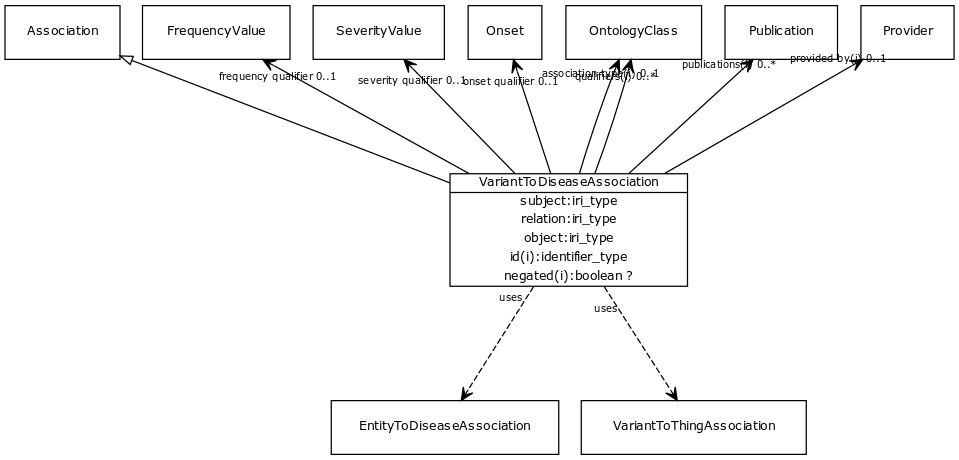

# Class: variant to disease association

URI: [http://bioentity.io/vocab/VariantToDiseaseAssociation](http://bioentity.io/vocab/VariantToDiseaseAssociation)

## Mappings

## Inheritance

 *  is_a: [association](Association.md) - A typed association between two entities, supported by evidence
 *  mixin: [variant to thing association](VariantToThingAssociation.md)
 *  mixin: [entity to disease association](EntityToDiseaseAssociation.md) - mixin class for any association whose object (target node) is a disease
## Children

## Used in

## Fields

 * _[frequency qualifier](frequency_qualifier.md)_
    * _a qualifier used in a phenotypic association to state how frequent the phenotype is observed in the subject_
    * range: [frequency value](FrequencyValue.md)
    * __Local__
 * _[severity qualifier](severity_qualifier.md)_
    * _a qualifier used in a phenotypic association to state how severe the phenotype is in the subject_
    * range: [severity value](SeverityValue.md)
    * __Local__
 * _[onset qualifier](onset_qualifier.md)_
    * _a qualifier used in a phenotypic association to state when the phenotype appears is in the subject_
    * range: [onset](Onset.md)
    * __Local__
 * _[subject](subject.md)_
    * _connects an association to the subject of the association. For example, in a gene-to-phenotype association, the gene is subject and phenotype is object._
    * range: string [required]
    * Example: [ClinVar:52241](http://purl.obolibrary.org/obo/ClinVar_52241) NM_000059.3(BRCA2):c.7007G>C (p.Arg2336Pro)
    * __Local__
 * _[relation](relation.md)_
    * _the relationship type by which a subject is connected to an object in an association_
    * range: [relationship type](RelationshipType.md) [required]
    * edge label: related condition
    * __Local__
 * _[object](object.md)_
    * _connects an association to the object of the association. For example, in a gene-to-phenotype association, the gene is subject and phenotype is object._
    * range: string [required]
    * Example: [MONDO:0016419](http://purl.obolibrary.org/obo/MONDO_0016419) hereditary breast cancer
    * __Local__
 * _[related to](related_to.md)_
    * _A grouping for any relationship type that holds between any two things_
    * range: [named thing](NamedThing.md)
    * inherited from: [named thing](NamedThing.md)
 * _[association type](association_type.md)_
    * _connects an association to the type of association (e.g. gene to phenotype)_
    * range: [ontology class](OntologyClass.md)
    * inherited from: None
 * _[qualifiers](qualifiers.md)_
    * _connects an association to qualifiers that modify or qualify the meaning of that association_
    * range: [ontology class](OntologyClass.md)*
    * inherited from: None
 * _[publications](publications.md)_
    * _connects an association to publications supporting the association_
    * range: [publication](Publication.md)*
    * inherited from: None
 * _[provided by](provided_by.md)_
    * _connects an association to the agent (person, organization or group) that provided it_
    * range: [provider](Provider.md)
    * inherited from: None
