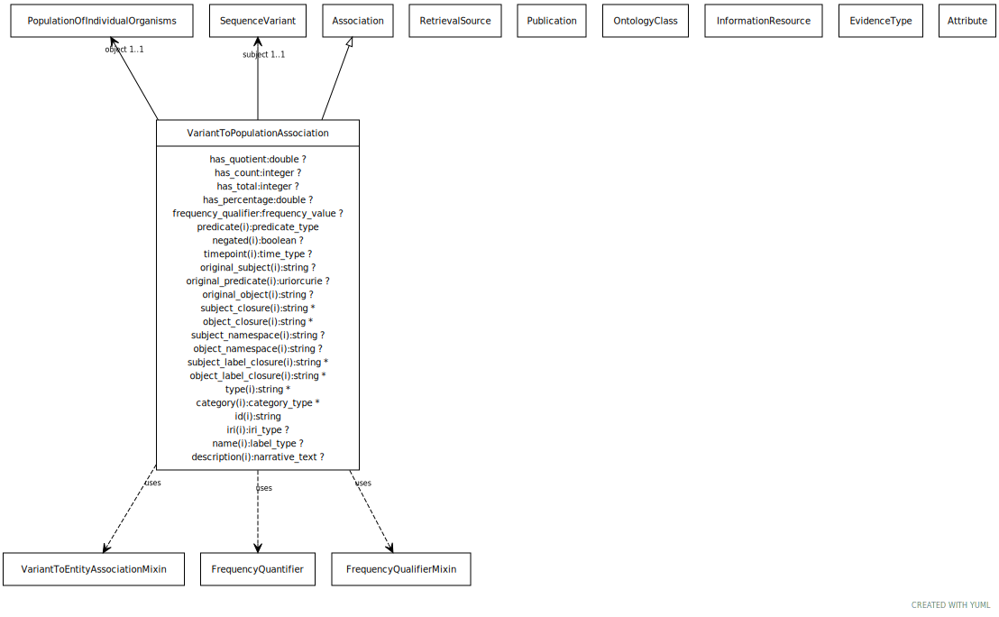

# Type: variant to population association

An association between a variant and a population, where the variant has particular frequency in the population

URI: [biolink:VariantToPopulationAssociation](https://w3id.org/biolink/vocab/VariantToPopulationAssociation)

## Parents

 *  is_a: [Association](Association.md) - A typed association between two entities, supported by evidence

## Uses Mixins

 *  mixin: [VariantToThingAssociation](VariantToThingAssociation.md)
 *  mixin: [FrequencyQuantifier](FrequencyQuantifier.md)
 *  mixin: [FrequencyQualifierMixin](FrequencyQualifierMixin.md) - Qualifier for frequency type associations

## Referenced by class

## Attributes

### Own

 * [variant to population association➞has count](variant_to_population_association_has_count.md)  OPT
    * Description: number in object population that carry a particular allele, aka allele count
    * range: [Integer](types/Integer.md)
    * Example:    
 * [variant to population association➞has quotient](variant_to_population_association_has_quotient.md)  OPT
    * Description: frequency of allele in population, expressed as a number with allele divided by number in reference population, aka allele frequency
    * range: [Double](types/Double.md)
    * Example:    
 * [variant to population association➞has total](variant_to_population_association_has_total.md)  OPT
    * Description: number all populations that carry a particular allele, aka allele number
    * range: [Integer](types/Integer.md)
    * Example:    
 * [variant to population association➞object](variant_to_population_association_object.md)  REQ
    * Description: the population that is observed to have the frequency
    * range: [PopulationOfIndividualOrganisms](PopulationOfIndividualOrganisms.md)
    * Example:    
 * [variant to population association➞subject](variant_to_population_association_subject.md)  REQ
    * Description: an allele that has a certain frequency in a given population
    * range: [SequenceVariant](SequenceVariant.md)
    * Example:    

### Inherited from association:

 * [association type](association_type.md)  OPT
    * Description: connects an association to the type of association (e.g. gene to phenotype)
    * range: [OntologyClass](OntologyClass.md)
 * [association➞id](association_id.md)  REQ
    * Description: A unique identifier for an association
    * range: [String](types/String.md)
    * in subsets: (translator_minimal)
 * [negated](negated.md)  OPT
    * Description: if set to true, then the association is negated i.e. is not true
    * range: [Boolean](types/Boolean.md)
 * [provided by](provided_by.md)  0..*
    * Description: connects an association to the agent (person, organization or group) that provided it
    * range: [Provider](Provider.md)
 * [publications](publications.md)  0..*
    * Description: connects an association to publications supporting the association
    * range: [Publication](Publication.md)
 * [qualifiers](qualifiers.md)  0..*
    * Description: connects an association to qualifiers that modify or qualify the meaning of that association
    * range: [OntologyClass](OntologyClass.md)
 * [relation](relation.md)  REQ
    * Description: The relation which describes an association between a subject and an object in a more granular manner. Usually this is a term from Relation Ontology, but it can be any edge CURIE.
    * range: [Uriorcurie](types/Uriorcurie.md)

### Mixed in from frequency qualifier mixin:

 * [frequency qualifier](frequency_qualifier.md)  OPT
    * Description: a qualifier used in a phenotypic association to state how frequent the phenotype is observed in the subject
    * range: [FrequencyValue](FrequencyValue.md)

### Mixed in from frequency quantifier:

 * [has percentage](has_percentage.md)  OPT
    * Description: equivalent to has quotient multiplied by 100
    * range: [Double](types/Double.md)
