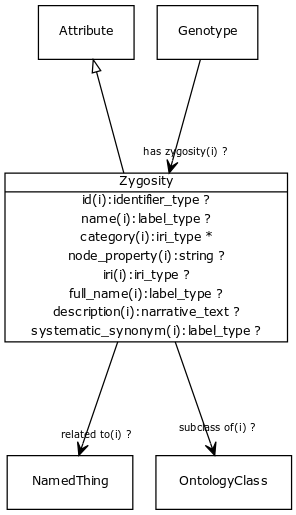

# Class: zygosity

URI: [http://bioentity.io/vocab/Zygosity](http://bioentity.io/vocab/Zygosity)

## Mappings

 * [GENO:0000133](http://purl.obolibrary.org/obo/GENO_0000133)
## Inheritance

 *  is_a: [attribute](Attribute.md) - A property or characteristic of an entity
## Children

## Used in

## Fields

 * _[subclass of](subclass_of.md) *subsets: translator_minimal*_
    * _holds between two classes where the domain class is a specialization of the range class_
    * range: [ontology class](OntologyClass.md)
    * inherited from: [ontology class](OntologyClass.md)
