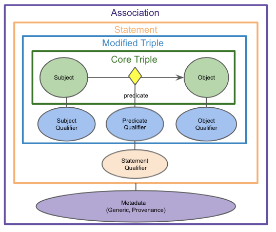

# Curating the Biolink Model

Before curating the Biolink Model, we recommend that you familiarize yourself with the basics of [LinkML](https://github.com/linkml).

In Biolink Model all the curation should happen in one place: [biolink-model.yaml](../biolink-model.yaml)
This is the one source of truth for the model.

This section explores how to go about adding new classes and slots to the model.




### Adding an Entity class

An entity class represents entities like Genes, Diseases, Chemical Substances, etc.

Instances of these Entity classes are represented as nodes in a graph.

Biolink Model has several entity classes such as `gene`, `disease`, `phenotypic feature`, `chemical substance`.

All these classes are arranged in a hierarchy with the root of all entities being the `named thing` class.


To add an entity class to Biolink Model you need to determine the following:
  - What is an appropriate name for this entity?
    - The name for an entity should be clear and concise. It should describe instances of this class
  - Where in the [`named thing` hierarchy](https://biolink.github.io/biolink-model/docs/NamedThing) does the new class fit?
    - Determine what the immediate parent for this class is going to be
  - What are the slots that this class can have (in addition to its inherited slots)?
    - Determine what additional properties that this class ought to have
  - Do certain slots have to be constrained to certain values?
    - Determine whether there are properties (new or inherited) whose value have to be constrained to a certain value space
  - What are the valid namespace prefixes for identifiers of instances of this class?
    - For representing an instance of this entity class determine the identifier namespace and valid prefix(es)
  - What are the mapping(s) for this class?
    - Mappings are a way of rooting this new entity classs in the context of other ontologies, thesauri, controlled vocabularies and taxonomies
    - Determine the level of granularity for your mappings where they can be divided into 5 types: `related_mappings`, `broad_mappings`, `narrow_mappings` `close_mappings`, `exact_mappings`


As an example, let's consider the definition of the entity class `gene`:

```yaml
  gene:
    is_a: gene or gene product
    aliases: ['locus']
    slots:
      - id
      - name
      - symbol
      - description
      - synonym
      - xref
    exact_mappings:
      - SO:0000704
      - SIO:010035
      - WIKIDATA:Q7187
    id_prefixes:
      - NCBIGene
      - ENSEMBL
      - HGNC
      - UniProtKB
      - MGI
      - ZFIN
      - dictyBase
      - WB
      - WormBase
      - FlyBase
      - FB
      - RGD
      - SGD
      - PomBase
```

In the above YAML snippet, `is_a`, `aliases`, `slots`, `exact_mappings`, and `id_prefixes` are slots from linkML where each slot has a specific meaning and they add semantics to the class definition.

In addition to the aforementioned slots, linkML provides ways to leverage mixin classes to reuse certain slots across different classes.

Say you want to use the mixin class `thing with taxon` that defines an `in taxon` slot.

You can achieve that as follows:

```yaml
  gene:
    is_a: gene or gene product
    mixins:
      - thing with taxon
    aliases: ['locus']
    ...
```

In the above YAML snippet, we are explicitly defining the entity class `gene` to have `in taxon` as a slot in addition to all its slots, its parent slots, and all of its ancestor slots.

There are [other linkML slots](https://linkml.github.io/linkml-model/docs/ClassDefinition#Attributes) that can be used to define your class and further capture the semantics of your class.

For more information on what each slot means and how to use them in Biolink Model, refer to [Using the Modeling Language](using-the-modeling-language.md).


### Adding an Association class

These modeling principles/desiderata have guided modeling choices throughout the qualifier-based approach 
to adding Association classes in Biolink.

- Nodes should represent core domain concepts: If possible, IRIs for KG nodes should represent fundamental domain concepts (genes, chemicals, phenotypes, diseases, etc.) This facilitates connections between primary entities of interest with fewer hops, and avoids the need to create/maintain/resolve new IRIs. 
   - Corollary: Limit dependencies on term creation by external ontologies:  We don’t want a scenario where we are waiting for external, unpredictable ontologies to add terms we need, e.g., addition of terms like ‘’severe bleeding” to HP, “early onset Alzheimers” to MONDO, or ‘’exposure to PM2.5” to ECTO.  
- Use qualifiers to compose full node semantics: When an identifier/IRI does not exist for a node concept in a standard, Translator-approved ontology, use qualifiers to post-compose their meaning. This is preferred over minting new ontology terms at a more granular level than is practical, or using structured data objects as Statement subject/objects.
- The ‘core triple’ should remain true if qualifiers are ignored: When using qualifiers, ensure that the core SPO triple remains true when qualifiers are ignored. (However, note that there may be one predicate used for the core triple and a different predicate for the qualified assertion.) If certain necessary qualifiers may violate this rule (e.g., ‘negated’), these should be flagged and NEVER ignored.
- Control predicate proliferation: When deciding where to place Statement semantics, choose modeling approaches that avoid a potential for an explosion of predicates. Pushing semantics into qualifiers is one way to achieve this.
- Represent information consistently: Where possible, a given type of semantics (e.g., gene aspect, direction of effect) should be represented using the same pattern across Statement types and components.  This will facilitate clear and consistent creation of data by KPs, and simplify query construction and answering.

As an example, let's consider the definition of class  `chemical affects gene association`:

```yaml
  chemical affects gene association:
    description: >-
      Describes an effect that a chemical has on a gene or gene product (e.g. an impact of on its abundance, activity,
      localization, processing, expression, etc.)
    is_a: association
    slots:
      - subject form or variant qualifier
      - subject part qualifier
      - subject derivative qualifier
      - subject aspect qualifier
      - subject context qualifier
      - subject direction qualifier
      - object form or variant qualifier
      - object part qualifier
      - object aspect qualifier
      - object context qualifier
      - causal mechanism qualifier
      - anatomical context qualifier
      - qualified predicate
    slot_usage:
      subject:
        range: chemical entity
      subject form or variant qualifier:
        range: chemical_or_gene_or_gene_product_form_or_variant_enum
      subject part qualifier:
        range: gene_or_gene_product_or_chemical_part_qualifier_enum
      subject derivative qualifier:
        range: chemical_entity_derivative_enum
      subject aspect qualifier:
        range: gene_or_gene_product_or_chemical_entity_aspect_enum
      subject context qualifier:
        range: anatomical entity
      subject direction qualifier:
        range: direction_qualifier_enum
      predicate:
        subproperty_of: affects
      qualified predicate:
        subproperty_of: causes
      object:
        range: gene or gene product
      object form or variant qualifier:
        range: chemical_or_gene_or_gene_product_form_or_variant_enum
      object part qualifier:
        range: gene_or_gene_product_or_chemical_part_qualifier_enum
      object aspect qualifier:
        range: gene_or_gene_product_or_chemical_entity_aspect_enum
      object context qualifier:
        range: anatomical entity
      object direction qualifier:
        range: direction_qualifier_enum
      causal mechanism qualifier:
        range: causal_mechanism_qualifier_enum
      anatomical context qualifier:
        range: anatomical entity
      species context qualifier:
        range: organism taxon
```

In the above YAML snippet, we first define the class `chemical affects gene association` as a subclass of `association` 
and then we define the slots that this class will have.  Many of these slots represent qualifiers that are used to 
refine the meaning of the association. For example, `object form or variant qualifier` is a slot that is used to
describe when a "mutant form" of a gene is used in an assertion.  This allows us to both represent that the gene
of interest (the object) is somehow related to the chemical of interest (the subject), and also that more specifically
we may be talking about a "mutant form" of the gene.  "mutant form" is a `biolink:object_form_or_variant_qualifier`.  This 
kind of modeling allows us to increase connectivity in graphs by using a core biological concept (gene) but also be
more specific and nuanced about the meaning of the association by qualifying the concept (gene) with a more specific
form of "mutant form" of that concept. 

For more information on qualifiers, please refer to [Understanding the Model](understanding-the-model.md)

For more information on what each slot means and how to use them in Biolink Model, refer to [Using the Modeling Language](using-the-modeling-language.md).


### Adding a predicate/relation

A predicate is a slot that links two instances of a class. 

To add a predicate to Biolink Model you need to determine the following:
  - What is an appropriate name for this predicate?
    - A human-readable name for this predicate that captures the nature of the relationship
  - Where in the hierarchy does the new slot fit?
    - Determine where in the [`related to` hierarchy](https://biolink.github.io/biolink-model/docs/related_to) this new predicate slot fits
  - What are the domain and range constraints (if any)?
    - Determine which type of entity classes this predicate can link
  - What are the mapping(s) for this slot?
    - Mappings are a way of rooting this new association in the context of other ontologies, thesauri, controlled vocabularies and taxonomies
    - Determine the level of granularity for your mappings--they can be divided into 5 types: `related_mappings`, `broad_mappings`, `narrow_mappings` `close_mappings`, `exact_mappings`
    # TODO: add the predicate discussion about inverse of canon to this document.
  - Determine the inverse of the predicate, and add it (specifying the inverse property on each of the two predicates)
    - In general, the canonical direction of the predicate should contain the descriptive information about the predicate while its inverse can be minimally defined.


As an example, let's consider the definition of slot `interacts with`:

```yaml
  interacts with:
    domain: named thing
    range: named thing
    description: >-
      holds between any two entities that directly or indirectly interact with each other
    is_a: related to
    in_subset:
      - translator_minimal
    symmetric: true
    exact_mappings:
      - RO:0002434
    narrow_mappings:
      - RO:0002103
      - RO:0002120
      - RO:0002130
      - SEMMEDDB:complicates
```

In the above YAML snippet, `domain`, `range`, `description`, `is_a`, `in_subset`, `symmetric`, `exact_mappings` and `narrow_mappings` are slots from linkML where each slot has a specific meaning and they add semantics to the slot definition.

For more information on what each slot means and how to use them in Biolink Model, refer to [Using the Modeling Language](using-the-modeling-language.md).


### Adding properties

You can add slots that represent node properties or edge properties.


To add a node/edge property to Biolink Model you need to determine the following:
  - What is an appropriate name for this slot?
    - A human-readable name for this property
  - Is it a node property or an edge property (association slot)?
    - Determine whether the property is a node or an edge property
  - Where in the hierarchy does the new property fit?
    - Determine where in the property hierarchy does this new property fit
    - If you want to add a node property then it should be added as part of the [`node property` hierarchy](https://biolink.github.io/biolink-model/docs/node_property)
    - If you want to add an edge property then it should be added as part of the [`association slot` hierarchy](https://biolink.github.io/biolink-model/docs/association_slot)
  - Is this a required property?
    - Determine whether all instances of a class must have a value for this property
  - What are the domain and range constraints (if any)?
    - Determine which type of classes can have this property and what the value space for this property should be
  - What are the mapping(s) for this slot?
    - Mappings are a way of rooting this new property in the context of other ontologies, thesauri, controlled vocabularies and taxonomies
    - Determine the level of granularity for your mappings--they can be divided into 5 types: `related_mappings`, `broad_mappings`, `narrow_mappings` `close_mappings`, `exact_mappings`


As an example, let's consider the slot `name` which is a node property:

```yaml
  name:
    is_a: node property
    aliases: ['label', 'display name']
    domain: named thing
    range: label type
    description: >-
      A human-readable name for a thing
    in_subset:
      - translator_minimal
    required: true
    slot_uri: rdfs:label
    exact_mappings:
      - gff3:Name
      - gpi:DB_Object_Name
```


As another example, let's consider the slot `relation` which is an edge property:

```yaml
  relation:
    is_a: association slot
    description: >-
      The relation which describes an association between a subject and an object in a more granular manner.
      Usually this is a term from Relation Ontology, but it can be any edge CURIE.
    domain: association
    range: uriorcurie
    required: true
```

In the above YAML snippets, `is_a`, `aliases`, `domain`, `range`, `description`, `in_subset`, `required`, `slot_uri`, `exact_mappings` are slots from linkML where each slot has a specific meaning and they add semantics to the slot definition.

There are [other linkML slots](https://linkml.github.io/linkml-model/docs/ClassDefinition#Attributes) that can be used to define your class and represent the semantics of your class.

For more information on what each slot means and how to use them in Biolink Model, refer to [Using the Modeling Language](using-the-modeling-language.md).


### Managing mappings

In the previous sections there were references to mappings and differentiating these mappings based on their granularity, which can be a bit of a nuanced exercise.

What does it mean for a external concept (or predicate or property) to be one of `related_mappings`, `broad_mappings`, `narrow_mappings` `close_mappings`, `exact_mappings`?

Here is a rule of thumb on how to determine the granularity of mapping:
- An external concept can be considered an exact mapping to a Biolink Model class or slot if the former can be used interchangeably with the latter. That is, the semantics are identical and any transitive property that the external concept might bring into the model should not violate the internal consistency of the model
- If it is difficult to determine if an external concept can be considered an exact mapping then it is much safer to treat it as a close mapping
- If an external concept can be treated a sub-class of the Biolink Model class or slot then it can be treated as a narrow mapping
- If an external concept can be treated as a super-class of the Biolink Model class or slot then it can be treated as a broad mapping
- If an external concept is distantly related to a Biolink Model class or slot then it can be treated as a related mapping

### Examples

The [NCATS Biomedical Translator Consortium](https://ncats.nih.gov/translator) has adopted Biolink Model as an open-source upper-level data model that supports semantic harmonization and 
reasoning across diverse Translator ‘knowledge sources’. The model serves a central role in the Translator program and forms the 
architectural basis of the Translator system, as described below. 

The Translator program aims to develop a comprehensive, relational, N-dimensional infrastructure designed to integrate disparate data 
sources—including objective signs and symptoms of disease, drug effects, chemical and genetic interactions, cell and organ pathology, 
and other relevant biological entities and relations—and reason over the integrated data to rapidly derive biomedical insights. 
The ultimate goal of Translator is to augment human reasoning and thereby accelerate translational science and knowledge discovery. 

To achieve its ambitious goal, the Translator project assembled a diverse interdisciplinary team and a variety of biomedical data 
sources, including electronic health record data, clinical trial data, genomic and other -omics data, chemical reaction data, and 
drug data. There are hundreds of data sources in the Translator ecosystem, each of which had its own data representation and were 
in formats that were not compatible or interoperable. Moreover, groups within the Translator Consortium had integrated the data 
sources as knowledge sources within independent KGs, but these KGs were developed using different technologies and formalisms 
such as property graphs in Neo4j and semantically-linked data via RDF and OWL. 

In order to interoperate between knowledge sources and reason across KGs, Biolink Model was adopted as the common dialect, thus 
enabling queries over the entire Translator KG ecosystem. The result was a federated, harmonized ecosystem that supports advanced 
reasoning and inference to derive biomedical insights based on user queries.

An example Translator use case involved a collaboration with investigators at the Hugh Kaul Precision Medicine Institute (PMI) at 
the University of Alabama at Birmingham. PMI investigators posed the following natural-language question to the Translator Consortium: 
what chemicals or drugs might be used to treat neurological disorders such as epilepsy that are associated with genomic 
variants of RHOBTB2? The investigators noted that RHOBTB2 variants cause an accumulation of RHOBTB2 protein and that this 
accumulation is believed to be the cause of the neurological disorder. 

To answer the PMI investigator’s question, Translator team members structured the following query: 
> NCBIGene:23221 (CURIE for RHOBTB2) -> [biolink:entity_regulates_entity, biolink:genetically_interacts_with] -> biolink:Protein, 
biolink:Gene -> [biolink:related_to] -> biolink:SmallMolecule

(see Figure 2 below). Because of the hierarchical structure of the Biolink model,
the use of biolink:related_to also will return more specific predicates such as biolink:negatively_regulates and biolink:positively_regulates. 
The objective was to identify drugs or chemicals that might regulate RHOBTB2 in some manner and thereby reduce the variant-induced 
accumulation of RHOBTB2 and associated neurological symptoms. As all nodes and edges within the Translator KG ecosystem are 
annotated to Biolink Model classes and attributes, a Translator query can be constructed from a natural-language user question 
and return results across a multitude of independent data sources. In addition, because the model employs hierarchical classes, 
with inheritance and polymorphism, natural-language queries translated to graph queries using Biolink Model syntax can be 
constructed at varying levels of granularity and return results from all levels of the hierarchy. Finally, because Biolink 
Model provides attributes on both edges and nodes that record provenance and evidence for these knowledge statements, each 
result is annotated with the trail of evidence that supports it.

When Translator team members sent the query to the Translator system, it returned several candidates of interest to PMI investigators, 
including fostamatinib disodium (CHEMBL.COMPOUND:CHEMBL3989516) and ruxolitinib (CHEMBL.COMPOUND:CHEMBL1789941). 
A review of the supporting evidence provided by Translator indicates that these are approved drugs that either directly or 
indirectly reduce or otherwise regulate the expression of RHOBTB2. Thus, Biolink Model helped Translator teams bring data 
together into a single system, thereby reducing the burden on the user to find and manually assemble data from these independent resources 
(see citation below).


Figure 2. An overview of the Translator architecture that supports biomedical KG-based question-answering, including the 
role of Biolink Model, in the context of an example question. In this example, a user has posed the natural-language question: 
what chemicals or drugs might be used to treat neurological disorders such as epilepsy that are associated with genomic variants of 
RHOBTB2? The question is translated into a graph query, as shown in the top left panel, which is then translated into a 
Translator standard machine query (not shown). The KG shown in the second panel from the left is derived from a variety
of diverse ‘knowledge sources’, a subset of which are displayed in the figure, that are exposed by Translator ‘knowledge providers’. 
Biolink Model provides standardization and semantic harmonization across the disparate knowledge sources, thereby allowing 
them to be integrated into a KG capable of supporting question-answering. In this example, Translator provided two answers or 
results of interest to the investigative team that posed the question, namely, fostamatinib disodium and ruxolitinib, as shown 
in the bottom left panel. 


Example is taken directly from: 
Biolink Model: A Universal Schema for Knowledge Graphs in Clinical, Biomedical, and Translational Science (2022).
Deepak R. Unni, Sierra A.T. Moxon, Michael Bada, Matthew Brush, Richard Bruskiewich, Paul Clemons, Vlado Dancik, 
Michel Dumontier, Karamarie Fecho, Gustavo Glusman, Jennifer J. Hadlock, Nomi L. Harris, Arpita Joshi, Tim Putman, 
Guangrong Qin, Stephen A. Ramsey, Kent A. Shefchek, Harold Solbrig, Karthik Soman, Anne T. Thessen, Melissa A. Haendel, 
Chris Bizon, Christopher J. Mungall, the Biomedical Data Translator Consortium. [https://arxiv.org/abs/2203.13906](https://arxiv.org/abs/2203.13906)
