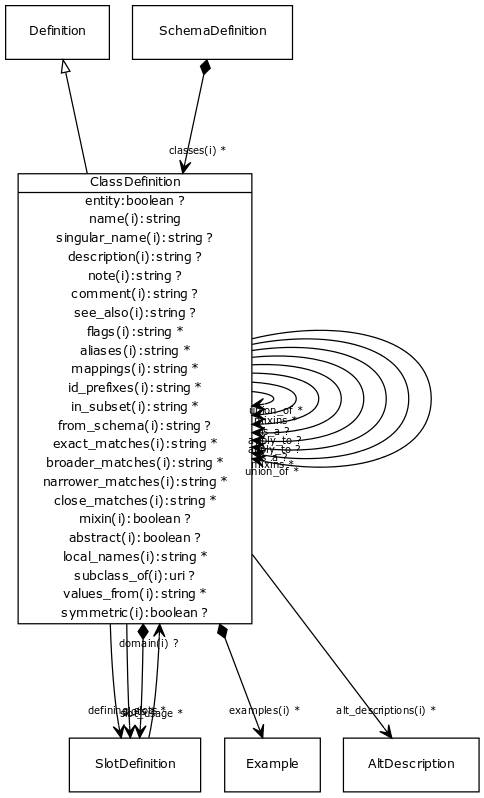

# Class: class definition

A class or interface

URI: [http://bioentity.io/vocab/ClassDefinition](http://bioentity.io/vocab/ClassDefinition)

## Mappings

## Inheritance

 *  is_a: [Definition](Definition.md) - definition base class
## Children

## Used in

 *  class: **[ClassDefinition](ClassDefinition.md)** *[apply_to](apply_to.md)* **[ClassDefinition](ClassDefinition.md)**
 *  class: **[ClassDefinition](ClassDefinition.md)** *[class definition.is_a](class_definition_is_a.md)* **[ClassDefinition](ClassDefinition.md)**
 *  class: **[ClassDefinition](ClassDefinition.md)** *[class definition.mixins](class_definition_mixins.md)* **[ClassDefinition](ClassDefinition.md)**
 *  class: **[ClassDefinition](ClassDefinition.md)** *[class definition.union_of](class_definition_union_of.md)* **[ClassDefinition](ClassDefinition.md)**
 *  class: **[SchemaDefinition](SchemaDefinition.md)** *[classes](classes.md)* **[ClassDefinition](ClassDefinition.md)**
 *  class: **[SlotDefinition](SlotDefinition.md)** *[domain](domain.md)* **[ClassDefinition](ClassDefinition.md)**
## Fields

 * [apply_to](apply_to.md)
    * Description: Used to extend an existing class definition. For example, if we have a core schema where a gene has two slots for identifier and symbol, and we have a specialized schema for my_organism where we wish to add a slot systematic_name, we can avoid subclassing by defining a class gene_my_organism, adding the slot to this class, and then adding an apply_to pointing to the gene class. The new slot will be 'injected into' the gene class.
    * range: [ClassDefinition](ClassDefinition.md)
    * __Local__
 * [class definition.is_a](class_definition_is_a.md)
    * Description: specifies single-inheritance between classes and slots. While multiple inheritance is not allowed, mixins can be provided effectively providing the same thing. The semantics are the same when translated to formalisms that allow MI (e.g. RDFS/OWL). When translating to a SI framework (e.g. java classes, python classes) then is_a is used. When translating a framework without polymorphism (e.g. json-schema, solr document schema) then is_a and mixins are recursively unfolded
    * range: [ClassDefinition](ClassDefinition.md)
    * __Local__
 * [class definition.mixins](class_definition_mixins.md)
    * Description: List of definitions to be mixed in. Targets may be any definition of the same type
    * range: [ClassDefinition](ClassDefinition.md)*
    * __Local__
 * [class definition.union_of](class_definition_union_of.md)
    * Description: list of class or slot definitions that are combined to create the union class
    * range: [ClassDefinition](ClassDefinition.md)*
    * __Local__
 * [defining_slots](defining_slots.md)
    * Description: The combination of is_a plus defining slots form a genus-differentia definition, or the set of necessary and sufficient conditions that can be transformed into an OWL equivalence axiom
    * range: [SlotDefinition](SlotDefinition.md)*
    * __Local__
 * [entity](entity.md)
    * range: **boolean**
    * __Local__
 * [slot_usage](slot_usage.md)
    * Description: Additional info on how a slot is used in the context of a class. Many slots may be re-used across different classes, but the meaning of the slot may be refined by context. For example, a generic association model may use slots subject/predicate/object with generic semantics and minimal constraints. When this is subclasses, e.g. to disease-phenotype associations then slot_usage may specify both local naming (e.g. subject=disease) and local constraints
    * range: [SlotDefinition](SlotDefinition.md)*
    * __Local__
 * [slots](slots.md)
    * Description: list of slot names that are applicable to a class. slots are by default inherited over is_a and mixins.
    * range: [SlotDefinition](SlotDefinition.md)*
    * __Local__
 * [abstract](abstract.md)
    * Description: An abstract class is a high level class or slot that is typically used to group common slots together and is generally not instantiated. When generating golr-views, abstract classes are ignored
    * range: **boolean**
    * inherited from: [Definition](Definition.md)
 * [aliases](aliases.md)
    * range: **string***
    * inherited from: [Element](Element.md)
 * [alt_descriptions](alt_descriptions.md)
    * range: [AltDescription](AltDescription.md)*
    * inherited from: [Element](Element.md)
 * [comment](comment.md)
    * Description: Comment about an element
    * range: **string**
    * inherited from: [Element](Element.md)
 * [description](description.md)
    * Description: a description
    * range: **string**
    * inherited from: [Element](Element.md)
 * [examples](examples.md)
    * Description: Example of usage for a slot or class
    * range: [Example](Example.md)*
    * inherited from: [Element](Element.md)
 * [flags](flags.md)
    * Description: State information and other details
    * range: **string***
    * inherited from: [Element](Element.md)
 * [from_schema](from_schema.md)
    * Description: id of the schema that the element was derived from.  Supplied by the loader.
    * range: **string**
    * inherited from: [Element](Element.md)
 * [id_prefixes](id_prefixes.md)
    * range: **string***
    * inherited from: [Element](Element.md)
 * [in_subset](in_subset.md)
    * Description: used to indicate membership of a term in a defined subset of biolink terms used for a particular domain or application (e.g. the translator_minimal subset holding the minimal set of predicates used in a translator knowledge graph)
    * range: **string***
    * inherited from: [Element](Element.md)
 * [local_names](local_names.md)
    * Description: map from local identifier to slot
    * range: **string***
    * inherited from: [Definition](Definition.md)
 * [mappings](mappings.md)
    * Description: list of equivalent or skos exact mappings to an ontology class
    * range: **string***
    * inherited from: [Element](Element.md)
 * [mixin](mixin.md)
    * Description: Used only as a mixin -- cannot be instantiated on its own.
    * range: **boolean**
    * inherited from: [Definition](Definition.md)
 * [name](name.md)
    * Description: a unique key that identifies a slot, type or class in a schema
    * range: **string**
    * inherited from: [Element](Element.md)
 * [note](note.md)
    * Description: Notes about an element
    * range: **string**
    * inherited from: [Element](Element.md)
 * [see_also](see_also.md)
    * range: **string**
    * inherited from: [Element](Element.md)
 * [singular_name](singular_name.md)
    * Description: a name that is used in the singular form
    * range: **string**
    * inherited from: [Element](Element.md)
 * [subclass_of](subclass_of.md)
    * Description: Ontolgy property which this is a subclass of. Not to be confused with is_a which links datamodel classes
    * range: **uri**
    * inherited from: [Definition](Definition.md)
 * [symmetric](symmetric.md)
    * Description: Symmetric slot
    * range: **boolean**
    * inherited from: [Definition](Definition.md)
 * [values_from](values_from.md)
    * Description: identifies the possible uri's of the range
    * range: **string***
    * inherited from: [Definition](Definition.md)
