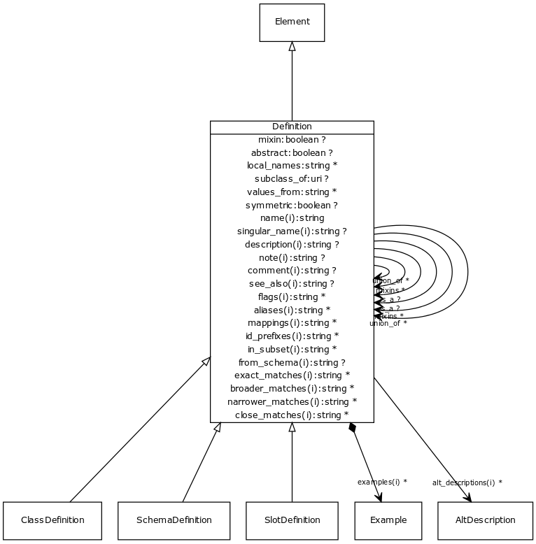

# Class: definition

definition base class

URI: [http://bioentity.io/vocab/Definition](http://bioentity.io/vocab/Definition)

## Mappings

## Inheritance

 *  is_a: [Element](Element.md) - root of all described things
## Children

 * [ClassDefinition](ClassDefinition.md) - A class or interface
 * [SchemaDefinition](SchemaDefinition.md) - A collection of definitions
 * [SlotDefinition](SlotDefinition.md) - A property or slot
## Used in

 *  class: **[Definition](Definition.md)** *[is_a](is_a.md)* **[Definition](Definition.md)**
 *  class: **[Definition](Definition.md)** *[mixins](mixins.md)* **[Definition](Definition.md)**
 *  class: **[Definition](Definition.md)** *[subclass_of](subclass_of.md)* **[Definition](Definition.md)**
 *  class: **[Definition](Definition.md)** *[union_of](union_of.md)* **[Definition](Definition.md)**
## Fields

 * _[abstract](abstract.md)_
    * _An abstract class is a high level class or slot that is typically used to group common slots together and is generally not instantiated. When generating golr-views, abstract classes are ignored_
    * range: **boolean**
    * __Local__
 * _[is_a](is_a.md)_
    * _specifies single-inheritance between classes and slots. While multiple inheritance is not allowed, mixins can be provided effectively providing the same thing. The semantics are the same when translated to formalisms that allow MI (e.g. RDFS/OWL). When translating to a SI framework (e.g. java classes, python classes) then is_a is used. When translating a framework without polymorphism (e.g. json-schema, solr document schema) then is_a and mixins are recursively unfolded_
    * range: [Definition](Definition.md)
    * __Local__
 * _[local_names](local_names.md)_
    * _map from local identifier to slot_
    * range: **string***
    * __Local__
 * _[mixin](mixin.md)_
    * _Used only as a mixin -- cannot be instantiated on its own._
    * range: **boolean**
    * __Local__
 * _[mixins](mixins.md)_
    * _List of definitions to be mixed in. Targets may be any definition of the same type_
    * range: [Definition](Definition.md)*
    * __Local__
 * _[subclass_of](subclass_of.md)_
    * _Ontolgy property which this is a subclass of. Not to be confused with is_a which links datamodel classes_
    * range: [Definition](Definition.md)
    * __Local__
 * _[symmetric](symmetric.md)_
    * _Symmetric slot_
    * range: **boolean**
    * __Local__
 * _[union_of](union_of.md)_
    * _list of class or slot definitions that are combined to create the union class_
    * range: [Definition](Definition.md)*
    * __Local__
 * _[values_from](values_from.md)_
    * _identifies the possible uri's of the range_
    * range: **string***
    * __Local__
 * _[aliases](aliases.md)_
    * range: **string***
    * inherited from: [Element](Element.md)
 * _[alt_descriptions](alt_descriptions.md)_
    * range: **string***
    * inherited from: [Element](Element.md)
 * _[comment](comment.md)_
    * _Comment about an element_
    * range: **string**
    * inherited from: [Element](Element.md)
 * _[description](description.md)_
    * _a description_
    * range: **string**
    * inherited from: [Element](Element.md)
 * _[examples](examples.md)_
    * _Example of usage for a slot or class_
    * range: [Example](Example.md)*
    * inherited from: [Element](Element.md)
 * _[flags](flags.md)_
    * _State information and other details_
    * range: **string***
    * inherited from: [Element](Element.md)
 * _[from_schema](from_schema.md)_
    * _id of the schema that the element was derived from.  Supplied by the loader._
    * range: **string**
    * inherited from: [Element](Element.md)
 * _[id_prefixes](id_prefixes.md)_
    * range: **string***
    * inherited from: [Element](Element.md)
 * _[in_subset](in_subset.md)_
    * _used to indicate membership of a term in a defined subset of biolink terms used for a particular domain or application (e.g. the translator_minimal subset holding the minimal set of predicates used in a translator knowledge graph)_
    * range: **string***
    * inherited from: [Element](Element.md)
 * _[mappings](mappings.md)_
    * _list of equivalent or skos exact mappings to an ontology class_
    * range: **string***
    * inherited from: [Element](Element.md)
 * _[name](name.md)_
    * _a unique key that identifies a slot, type or class in a schema_
    * range: **string**
    * inherited from: [Element](Element.md)
 * _[note](note.md)_
    * _Notes about an element_
    * range: **string**
    * inherited from: [Element](Element.md)
 * _[prefixes](prefixes.md)_
    * _list of ID/CURIE prefixes applicable to that element_
    * range: **string***
    * inherited from: [Element](Element.md)
 * _[see_also](see_also.md)_
    * range: **string**
    * inherited from: [Element](Element.md)
 * _[singular_name](singular_name.md)_
    * _a name that is used in the singular form_
    * range: **string**
    * inherited from: [Element](Element.md)
