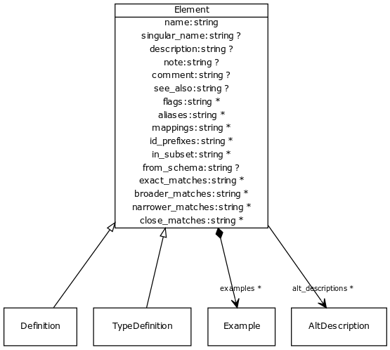

# Class: element

root of all described things

URI: [http://bioentity.io/vocab/Element](http://bioentity.io/vocab/Element)

## Mappings

## Inheritance

## Children

 * definition
 * type definition
## Used in

 *  class: **slot definition** *range* **element**
## Fields

 * _aliases_
    * range: **string***
    * __Local__
 * _alt_descriptions_
    * range: **string***
    * __Local__
 * _comment_
    * _Comment about an element_
    * range: **string**
    * __Local__
 * _description_
    * _a description_
    * range: **string**
    * __Local__
 * _examples_
    * _Example of usage for a slot or class_
    * range: example*
    * __Local__
 * _flags_
    * _State information and other details_
    * range: **string***
    * __Local__
 * _from_schema_
    * _id of the schema that the element was derived from.  Supplied by the loader._
    * range: **string**
    * __Local__
 * _id_prefixes_
    * range: **string***
    * __Local__
 * _in_subset_
    * _used to indicate membership of a term in a defined subset of biolink terms used for a particular domain or application (e.g. the translator_minimal subset holding the minimal set of predicates used in a translator knowledge graph)_
    * range: **string***
    * __Local__
 * _mappings_
    * _list of equivalent or skos exact mappings to an ontology class_
    * range: **string***
    * __Local__
 * _name_
    * _a unique key that identifies a slot, type or class in a schema_
    * range: **string**
    * __Local__
 * _note_
    * _Notes about an element_
    * range: **string**
    * __Local__
 * _prefixes_
    * _list of ID/CURIE prefixes applicable to that element_
    * range: **string***
    * __Local__
 * _see_also_
    * range: **string**
    * __Local__
 * _singular_name_
    * _a name that is used in the singular form_
    * range: **string**
    * __Local__
