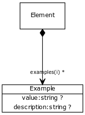

# Class: example

example of usage

URI: [http://bioentity.io/vocab/Example](http://bioentity.io/vocab/Example)

## Mappings

## Inheritance

## Children

## Used in

 *  class: **element** *examples* **example**
## Fields

 * _value_
    * range: **string**
    * __Local__
 * _value description_
    * range: **string**
    * __Local__
