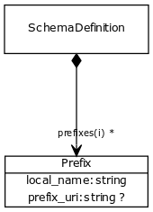

# Class: prefix

Prefix URI map

URI: [http://bioentity.io/vocab/Prefix](http://bioentity.io/vocab/Prefix)

## Mappings

## Inheritance

## Children

## Used in

 *  class: **[SchemaDefinition](SchemaDefinition.md)** *[prefixes](prefixes.md)* **[Prefix](Prefix.md)**
## Fields

 * _[local name](local_name.md)_
    * _the nsname (sans ':' for a given prefix)_
    * range: **string**
    * __Local__
 * _[prefix uri](prefix_uri.md)_
    * _A URI associated with a given prefix_
    * range: **string**
    * __Local__
