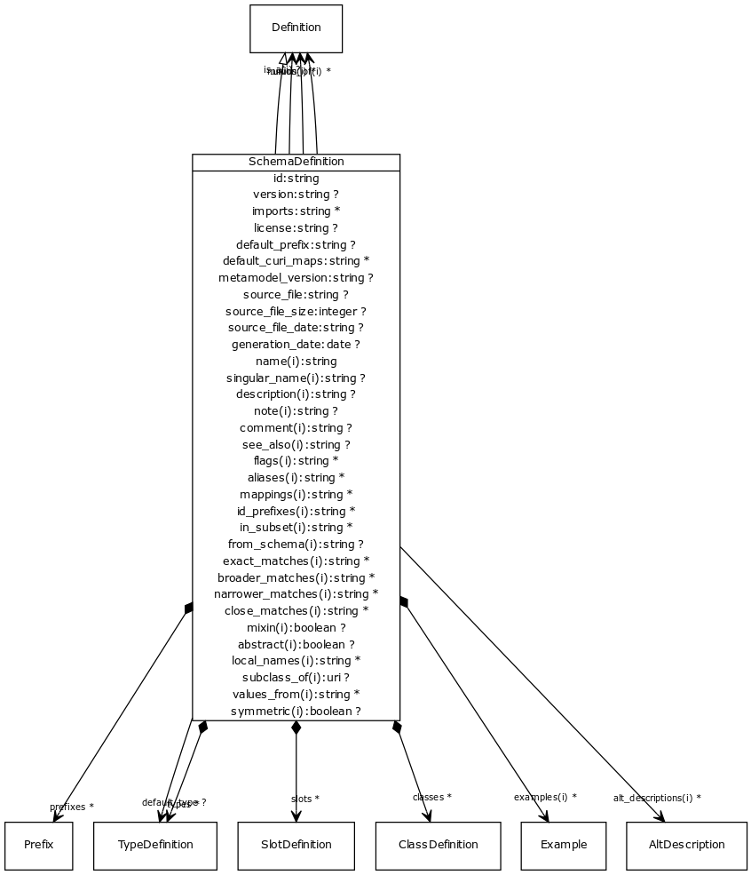

# Class: schema definition

A collection of definitions

URI: [http://bioentity.io/vocab/SchemaDefinition](http://bioentity.io/vocab/SchemaDefinition)

## Mappings

## Inheritance

 *  is_a: definition
## Children

## Used in

## Fields

 * _classes_
    * _classes defined in schema_
    * range: class definition*
    * __Local__
 * _generation_date_
    * _date that the schema was loaded/generated.  Supplied by the loader_
    * range: **date**
    * __Local__
 * _id_
    * _a globally unique id or url for a schema_
    * range: **string**
    * __Local__
 * _imports_
    * _A list of modules that are imported into the schema_
    * range: **string***
    * __Local__
 * _license_
    * _license for the schema_
    * range: **string**
    * __Local__
 * _metamodel_version_
    * _Version of the metamodel used to load the schema. Supplied by the loader_
    * range: **string**
    * __Local__
 * _slot definitions_
    * _collection of slot definitions in a schema_
    * range: slot definition*
    * __Local__
 * _source_file_
    * _name, uri or description of the source of the schema.  Supplied by the loader_
    * range: **string**
    * __Local__
 * _source_file_date_
    * _modification date of the source of the schema.  Supplied by the loader_
    * range: **string**
    * __Local__
 * _source_file_size_
    * _size in bytes of the source of the schema.  Supplied by the loader_
    * range: **integer**
    * __Local__
 * _types_
    * _types defined in schema_
    * range: type definition*
    * __Local__
 * _version_
    * _Schema version_
    * range: **string**
    * __Local__
 * _abstract_
    * _An abstract class is a high level class or slot that is typically used to group common slots together and is generally not instantiated. When generating golr-views, abstract classes are ignored_
    * range: **boolean**
    * inherited from: definition
 * _aliases_
    * range: **string***
    * inherited from: element
 * _alt_descriptions_
    * range: **string***
    * inherited from: element
 * _comment_
    * _Comment about an element_
    * range: **string**
    * inherited from: element
 * _description_
    * _a description_
    * range: **string**
    * inherited from: element
 * _examples_
    * _Example of usage for a slot or class_
    * range: example*
    * inherited from: element
 * _flags_
    * _State information and other details_
    * range: **string***
    * inherited from: element
 * _from_schema_
    * _id of the schema that the element was derived from.  Supplied by the loader._
    * range: **string**
    * inherited from: element
 * _id_prefixes_
    * range: **string***
    * inherited from: element
 * _in_subset_
    * _used to indicate membership of a term in a defined subset of biolink terms used for a particular domain or application (e.g. the translator_minimal subset holding the minimal set of predicates used in a translator knowledge graph)_
    * range: **string***
    * inherited from: element
 * _is_a_
    * _specifies single-inheritance between classes and slots. While multiple inheritance is not allowed, mixins can be provided effectively providing the same thing. The semantics are the same when translated to formalisms that allow MI (e.g. RDFS/OWL). When translating to a SI framework (e.g. java classes, python classes) then is_a is used. When translating a framework without polymorphism (e.g. json-schema, solr document schema) then is_a and mixins are recursively unfolded_
    * range: definition
    * inherited from: definition
 * _local_names_
    * _map from local identifier to slot_
    * range: **string***
    * inherited from: definition
 * _mappings_
    * _list of equivalent or skos exact mappings to an ontology class_
    * range: **string***
    * inherited from: element
 * _mixin_
    * _Used only as a mixin -- cannot be instantiated on its own._
    * range: **boolean**
    * inherited from: definition
 * _mixins_
    * _List of definitions to be mixed in. Targets may be any definition of the same type_
    * range: definition*
    * inherited from: definition
 * _name_
    * _a unique key that identifies a slot, type or class in a schema_
    * range: **string**
    * inherited from: element
 * _note_
    * _Notes about an element_
    * range: **string**
    * inherited from: element
 * _prefixes_
    * _list of ID/CURIE prefixes applicable to that element_
    * range: **string***
    * inherited from: element
 * _see_also_
    * range: **string**
    * inherited from: element
 * _singular_name_
    * _a name that is used in the singular form_
    * range: **string**
    * inherited from: element
 * _subclass_of_
    * _Ontolgy property which this is a subclass of. Not to be confused with is_a which links datamodel classes_
    * range: definition
    * inherited from: definition
 * _symmetric_
    * _Symmetric slot_
    * range: **boolean**
    * inherited from: definition
 * _union_of_
    * _list of class or slot definitions that are combined to create the union class_
    * range: definition*
    * inherited from: definition
 * _values_from_
    * _identifies the possible uri's of the range_
    * range: **string***
    * inherited from: definition
