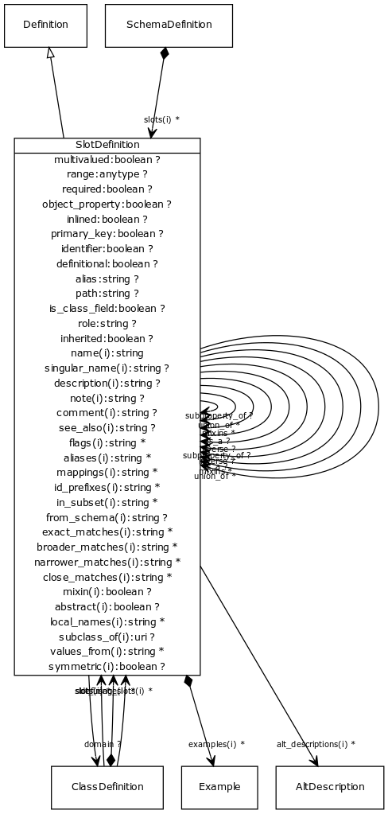

# Class: slot definition

A property or slot

URI: [http://bioentity.io/vocab/SlotDefinition](http://bioentity.io/vocab/SlotDefinition)

## Mappings

## Inheritance

 *  is_a: [Definition](Definition.md) - definition base class
## Children

## Used in

 *  class: **[ClassDefinition](ClassDefinition.md)** *[defining_slots](defining_slots.md)* **[SlotDefinition](SlotDefinition.md)**
 *  class: **[SlotDefinition](SlotDefinition.md)** *[inverse](inverse.md)* **[SlotDefinition](SlotDefinition.md)**
 *  class: **[SlotDefinition](SlotDefinition.md)** *[slot definition.is_a](slot_definition_is_a.md)* **[SlotDefinition](SlotDefinition.md)**
 *  class: **[SlotDefinition](SlotDefinition.md)** *[slot definition.mixins](slot_definition_mixins.md)* **[SlotDefinition](SlotDefinition.md)**
 *  class: **[SlotDefinition](SlotDefinition.md)** *[slot definition.union_of](slot_definition_union_of.md)* **[SlotDefinition](SlotDefinition.md)**
 *  class: **[SchemaDefinition](SchemaDefinition.md)** *[schema definition.slots](slot_definitions.md)* **[SlotDefinition](SlotDefinition.md)**
 *  class: **[ClassDefinition](ClassDefinition.md)** *[slot_usage](slot_usage.md)* **[SlotDefinition](SlotDefinition.md)**
 *  class: **[ClassDefinition](ClassDefinition.md)** *[slots](slots.md)* **[SlotDefinition](SlotDefinition.md)**
 *  class: **[SlotDefinition](SlotDefinition.md)** *[subproperty_of](subproperty_of.md)* **[SlotDefinition](SlotDefinition.md)**
## Fields

 * _[alias](alias.md)_
    * _A name to be assigned to the slot in implementations that is different that its type.  The primary use for this is to allow class AND schema definitions to both have "slots" where one inline and the other a reference_
    * range: **string**
    * __Local__
 * _[definitional](definitional.md)_
    * range: **boolean**
    * __Local__
 * _[domain](domain.md)_
    * _The class to which this slot applies._
    * range: [ClassDefinition](ClassDefinition.md)
    * __Local__
 * _[identifier](identifier.md)_
    * _True means that this slot must be unique across the collection of slots_
    * range: **boolean**
    * __Local__
 * _[inherited](inherited.md)_
    * _True means that the slot is an essential attribute of the container -- that the slot is carried across is_a and slot_usage paths_
    * range: **boolean**
    * __Local__
 * _[inlined](inlined.md)_
    * _if true then the value of this slot is inlined (i.e. a nested object) rather linked by key_
    * range: **boolean**
    * __Local__
 * _[inverse](inverse.md)_
    * _used to indicate the inverse of a slot (e.g. 'expresses' is the inverse predicate of 'expressed in')_
    * range: [SlotDefinition](SlotDefinition.md)
    * __Local__
 * _[is_class_field](is_class_field.md)_
    * range: **boolean**
    * __Local__
 * _[multivalued](multivalued.md)_
    * _If true slot can have many values_
    * range: **boolean**
    * __Local__
 * _[object_property](object_property.md)_
    * _true means that this slot is part of the formal definition of a class_
    * range: **boolean**
    * __Local__
 * _[path](path.md)_
    * _For any denormalized slot, this represents the tree or graph path used to generate the denormalized form_
    * range: **string**
    * __Local__
 * _[primary_key](primary_key.md)_
    * _True means that this serves as a unique identifier_
    * range: **boolean**
    * __Local__
 * _[range](range.md)_
    * _The slot type.  Can be any class or type_
    * range: **anytype**
    * __Local__
 * _[required](required.md)_
    * _If true slot must have at least one value_
    * range: **boolean**
    * __Local__
 * _[role](role.md)_
    * range: **string**
    * __Local__
 * _[slot definition.is_a](slot_definition_is_a.md)_
    * _specifies single-inheritance between classes and slots. While multiple inheritance is not allowed, mixins can be provided effectively providing the same thing. The semantics are the same when translated to formalisms that allow MI (e.g. RDFS/OWL). When translating to a SI framework (e.g. java classes, python classes) then is_a is used. When translating a framework without polymorphism (e.g. json-schema, solr document schema) then is_a and mixins are recursively unfolded_
    * range: [SlotDefinition](SlotDefinition.md)
    * __Local__
 * _[slot definition.mixins](slot_definition_mixins.md)_
    * _List of definitions to be mixed in. Targets may be any definition of the same type_
    * range: [SlotDefinition](SlotDefinition.md)*
    * __Local__
 * _[slot definition.union_of](slot_definition_union_of.md)_
    * _list of class or slot definitions that are combined to create the union class_
    * range: [SlotDefinition](SlotDefinition.md)*
    * __Local__
 * _[subproperty_of](subproperty_of.md)_
    * _Ontolgy property which this is a subproperty of_
    * range: [SlotDefinition](SlotDefinition.md)
    * __Local__
 * _[abstract](abstract.md)_
    * _An abstract class is a high level class or slot that is typically used to group common slots together and is generally not instantiated. When generating golr-views, abstract classes are ignored_
    * range: **boolean**
    * inherited from: [Definition](Definition.md)
 * _[aliases](aliases.md)_
    * range: **string***
    * inherited from: [Element](Element.md)
 * _[alt_descriptions](alt_descriptions.md)_
    * range: **string***
    * inherited from: [Element](Element.md)
 * _[comment](comment.md)_
    * _Comment about an element_
    * range: **string**
    * inherited from: [Element](Element.md)
 * _[description](description.md)_
    * _a description_
    * range: **string**
    * inherited from: [Element](Element.md)
 * _[examples](examples.md)_
    * _Example of usage for a slot or class_
    * range: [Example](Example.md)*
    * inherited from: [Element](Element.md)
 * _[flags](flags.md)_
    * _State information and other details_
    * range: **string***
    * inherited from: [Element](Element.md)
 * _[from_schema](from_schema.md)_
    * _id of the schema that the element was derived from.  Supplied by the loader._
    * range: **string**
    * inherited from: [Element](Element.md)
 * _[id_prefixes](id_prefixes.md)_
    * range: **string***
    * inherited from: [Element](Element.md)
 * _[in_subset](in_subset.md)_
    * _used to indicate membership of a term in a defined subset of biolink terms used for a particular domain or application (e.g. the translator_minimal subset holding the minimal set of predicates used in a translator knowledge graph)_
    * range: **string***
    * inherited from: [Element](Element.md)
 * _[local_names](local_names.md)_
    * _map from local identifier to slot_
    * range: **string***
    * inherited from: [Definition](Definition.md)
 * _[mappings](mappings.md)_
    * _list of equivalent or skos exact mappings to an ontology class_
    * range: **string***
    * inherited from: [Element](Element.md)
 * _[mixin](mixin.md)_
    * _Used only as a mixin -- cannot be instantiated on its own._
    * range: **boolean**
    * inherited from: [Definition](Definition.md)
 * _[name](name.md)_
    * _a unique key that identifies a slot, type or class in a schema_
    * range: **string**
    * inherited from: [Element](Element.md)
 * _[note](note.md)_
    * _Notes about an element_
    * range: **string**
    * inherited from: [Element](Element.md)
 * _[see_also](see_also.md)_
    * range: **string**
    * inherited from: [Element](Element.md)
 * _[singular_name](singular_name.md)_
    * _a name that is used in the singular form_
    * range: **string**
    * inherited from: [Element](Element.md)
 * _[subclass_of](subclass_of.md)_
    * _Ontolgy property which this is a subclass of. Not to be confused with is_a which links datamodel classes_
    * range: **uri**
    * inherited from: [Definition](Definition.md)
 * _[symmetric](symmetric.md)_
    * _Symmetric slot_
    * range: **boolean**
    * inherited from: [Definition](Definition.md)
 * _[values_from](values_from.md)_
    * _identifies the possible uri's of the range_
    * range: **string***
    * inherited from: [Definition](Definition.md)
