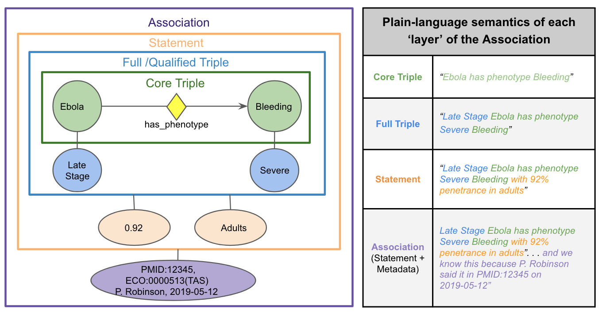

# Biolink Model 3.0 Migration Guide

Please feel free to contact the data modeling team for advice, there are a lot of changes!
In general, we represent statements of knowledge using the "onion" model, where the core triple (the subject, predicate
and object) is qualified in one layer and provenance is added in another.

Note: association object has a "qualifiers" slot that is not currently modeled to contain all qualifiers on an edge.
instead this is a left-over property that will be deprecated when more of the qualifier methodology is 
instantiated in the model. 


An example of this is below, modeling the knowledge statement: 
```bash
Late Stage Ebola has phenotype Severe Bleeding with 92%  penetrance in adults
```



## For guidance in migrating existing predicates, to their fully qualified Association-based counterparts, please refer to: 

- [Deprecated predicate to qualifier mappings](predicate_mapping.yaml)
This is a mapping file that shows how deprecated predicates like "increases expression of" can be translated
to their equivalent Association-based, qualifiier representation. 

- [Association semantics using qualifiers](association-examples-with-qualifiers.md)
This is a general guide with examples of fully qualified Associations in the chemical-to-gene domain.

- [Predicate transformation table](images/predicate_transformation.pdf)
View the predicate transformations to qualifiers in the predicate hierarchy


### Deprecated Predicates:

Code to list deprecated predicates, classes and associations can be found here: https://tinyurl.com/ycyd3xae

 * affects abundance of
 * abundance affected by
 * increases abundance of
 * abundance increased by
 * decreases abundance of
 * abundance decreased by
 * increases activity of
 * affects activity of
 * activity affected by
 * activity increased by
 * affects expression in
 * decreases activity of
 * activity decreased by
 * affects expression of
 * expression affected by
 * increases expression of
 * expression increased by
 * decreases expression of
 * expression decreased by
 * affects folding of
 * folding affected by
 * increases folding of
 * folding increased by
 * decreases folding of
 * folding decreased by
 * affects localization of
 * localization affected by
 * increases localization of
 * localization increased by
 * decreases localization of
 * localization decreased by
 * affects metabolic processing of
 * metabolic processing affected by
 * increases metabolic processing of
 * metabolic processing increased by
 * decreases metabolic processing of
 * metabolic processing decreased by
 * affects molecular modification of
 * molecular modification affected by
 * increases molecular modification of
 * molecular modification increased by
 * decreases molecular modification of
 * molecular modification decreased by
 * affects synthesis of
 * synthesis affected by
 * increases synthesis of
 * synthesis increased by
 * decreases synthesis of
 * synthesis decreased by
 * affects degradation of
 * degradation affected by
 * increases degradation of
 * degradation increased by
 * decreases degradation of
 * degradation decreased by
 * affects mutation rate of
 * mutation rate affected by
 * increases mutation rate of
 * mutation rate increased by
 * decreases mutation rate of
 * mutation rate decreased by
 * affects splicing of
 * splicing affected by
 * increases splicing of
 * splicing increased by
 * decreases splicing of
 * splicing decreased by
 * affects stability of
 * stability affected by
 * increases stability of
 * stability increased by
 * decreases stability of
 * stability decreased by
 * affects transport of
 * transport affected by
 * increases transport of
 * transport increased by
 * decreases transport of
 * transport decreased by
 * affects secretion of
 * secretion affected by
 * increases secretion of
 * secretion increased by
 * decreases secretion of
 * secretion decreased by
 * affects uptake of
 * uptake affected by
 * increases uptake of
 * uptake increased by
 * decreases uptake of
 * uptake decreased by

Instead of these predicates, please use a pattern like this (note: each transformation from specific predicate 
to generic predicate with qualifiers will require different transforms, please refer to this spreadsheet for a guide):
```bash
subject: x
predicate: affects
qualified predicate: causes
object: y
object aspect qualifier: values from gene_or_gene_product_or_chemical_entity_aspect_enum
object direction qualfiier: values from direction_qualifier_enum
```

 * positively regulates
 * positively regulated by
 * negatively regulates
 * negatively regulated by
 * process regulates process
 * process regulated by process
 * process positively regulates process
 * process positively regulated by process
 * process negatively regulates process
 * process negatively regulated by process
 * entity regulates entity
 * entity regulated by entity
 * entity positively regulates entity
 * entity positively regulated by entity
 * entity negatively regulates entity
 * entity negatively regulated by entity

Instead of these predicates, please use:

```bash
subject: x
predicate: regulates
qualified predicate: causes
object: y
object direction qualifier: values from: direction_qualifier_enum 
object aspect qualifier: values from: gene_or_gene_product_or_chemical_entity_aspect_enum
```

 * approved to treat
 * approved for treatment by

Instead of this predicate please use the edge property: FDA approval status 
With values from: FDA_approval_status_enum

 * has real world evidence of association with

Instead of this predicate please use one of the following predicates:

Correlated with 
Positively correlated with 
Negatively correlated with 
Associated with 
Associated with likelihood of


 * directly interacts with
 * decreases molecular interaction
 * molecular interaction decreased by
 * increases molecular interaction
 * molecular interaction increased by
 * chemically interacts with
 * molecularly interacts with

Instead of these predicates please use one of the following:

 * physically interacts with
 * binds
 * directly physically interacts with
 * indirectly physically interacts with

### Deprecated edge properties (qualifiers):

 * has population context
 * has temporal context

Instead of these qualifiers, please use one of the following qualifiers:
 * context qualifier
 * anatomical context qualifier 
 * temporal context qualifier

### Deprecate classes and associations:

 * chemical to gene association

### Deprecations in previous releases, now removed:
 * source

# Additions:

subject and object qualifiers:
 * aspect qualifier
 * derivative qualifier
 * part qualifier
 * context qualifier
 * direction qualifier
 * qualified predicate

### Association qualifiers:

 * statement qualifier
 * causal mechanism qualifier
 * anatomical context qualifier
 * species context qualifier 

### Enumerations:

 * anatomical_context_qualifier_enum
 * direction_qualifier_enum
 * chemical_entity_derivative_enum
 * chemical_or_gene_or_gene_product_form_enum
 * gene_or_gene_product_or_chemical_part_qualifier_enum
 * gene_or_gene_product_or_chemical_entity_aspect_enum
 * causal_mechanism_qualifier_enum


### Associations: 

 * chemical gene interaction association
 * chemical affects gene association
 * named thing associated with likelihood of named thing association


### TRAPI Examples 

Please see examples in the [TRAPI repository](https://github.com/NCATSTranslator/ReasonerAPI/tree/master/examples/Message)


# Biolink Model 2.0 Migration Guide

### Summary of chemical changes in Biolink-Model 2.0.0


 * Refactor of the 'Molecular Entity' and 'Chemical Substance' classes and hierarchy.
 * 'Genomic Entity' is now a 'mixin' rather than a class.
 * 'Chemical Substance' class is deprecated in favor of 'Small Molecule' (child of 'Molecular Entity').
 * New classes: 'Chemical Entity', 'Chemical Mixture', 'Complex Chemical Mixture', 'Small Molecule Entity', 'Polypeptide', 'Nucleic Acid Entity'.
 * 'Gene' now is a child of 'Nucleic Acid Entity'.
 * 'Nucleic Acid Entity' now groups DNA, RNA, etc.
 * 'Protein' is a child of 'Polypeptide'.
 * 'Carbohydrate', 'FoodComponent', and 'Metabolite' are deprecated.

### Summary of evidence/provenance related changes in Biolink-Model 2.0.0
 
 * New classes: 'Information Resource'
 * New association slots (edge properties): 'knowledge source', 'primary knowledge source', 'original knowledge source', 'aggregator knowledge source', 'supporting data source'

### Summary of reaction related changes in Biolink-Model 2.0.0
 
 

 * New association classes: ‘Reaction To Participant Association’, ‘Reaction To Catalyst Association’.
 * New predicates (and inverses): 'catalyzes', 'has substrate', 'consumes'.
 * EC numbers help define the 'Molecular Activity' class.  

### Inverses 

 * added inverses for the majority of biolink predicates.
 * primary direction of predicate tagged with 'biolink:canonical_predicate'.

### Deprecated items removed
 
 * assciation_id, edge label, association type, disease or phenotypic feature association to location association.
