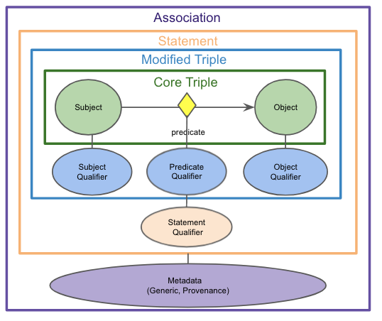

# Curating the Biolink Model

Before curating the Biolink Model, we recommend that you familiarize yourself with the basics of [LinkML](https://github.com/linkml) and its
metamodel components.  Like many modeling frameworks, LinkML comes with a controlled vocabulary of 
[terms](https://linkml.io/linkml-model/latest/) that are used to describe the model.  While the modeling language
is robust and might seem overwhelming, understanding just a few basic components like: 

* [classes](https://linkml.io/linkml-model/latest/docs/ClassDefinition.html)
* [slots](https://linkml.io/linkml-model/latest/docs/SlotDefinition.html)
* [exact_mappings](https://linkml.io/linkml-model/latest/docs/exact_mappings/)
* [aliases](https://linkml.io/linkml-model/latest/docs/aliases/)
* [is_a](https://linkml.io/linkml-model/latest/docs/is_a/)
* [range](https://linkml.io/linkml-model/latest/docs/range/)
* [domain](https://linkml.io/linkml-model/latest/docs/domain/)

will be extremely helpful.  For more information on LinkML refer to [Using the Modeling Language](using-the-modeling-language.md).
For more information about LinkML, please refer to the tutorial [here](https://linkml.github.io/linkml-tutorial/).

In Biolink Model all the curation should happen in one place: [biolink-model.yaml](biolink-model.yaml)
This is the one source of truth for the model.

### PR Guidelines

- All of our modeling and example data should be as clear as possible. 
- Textual annotations on classes, slots and enumerations should be written with minimal jargon.
- If it is necessary to retain external content as-is, like descriptions, they should be attributed using the 
appropriate LinkML meta-slots, and we should also strive to provide clarification in appropriate meta-slots.
- Team members  adding new modeling bear the responsibility of re-using existing elements or demonstrating to the team 
how their proposed alternative modeling is generally superior. This can be simplified by keeping pull requests small. 
Diligent modeling efforts should be acknowledged, especially for newer contributors. A decision to not merge
in part of the work does not mean that the work isn’t appreciated or has been thrown away, as closed but unmerged pull 
requests could be revisited in the future.

Please run `make test` before submitting a PR to ensure that the model is valid.
Please resolve conflicts before submitting a PR to help aid the PR reviewer. Note: if you have conflicts in 
files in the `project` directory, running `make test` after a `master` (main) branch merge into your branch 
will clear them.  Please feel free to commit the regenerated artifacts.

### Adding an Entity class

To add an entity class to Biolink Model you need to determine the following:
  - What is an appropriate name for this entity?
    - The name for an entity should be clear and concise. It should describe instances of this class
  - Where in the [`named thing` hierarchy](https://biolink.github.io/biolink-model/NamedThing) does the new class fit?
    - Determine what the immediate parent for this class is going to be
  - What are the slots that this class can have (in addition to its inherited slots)?
    - Determine what additional properties that this class ought to have
  - Do certain slots have to be constrained to certain values?
    - Determine whether there are properties (new or inherited) whose value have to be constrained to a certain value space
  - What are the valid namespace prefixes for identifiers of instances of this class?
    - For representing an instance of this entity class determine the identifier namespace and valid prefix(es)
  - What are the mapping(s) for this class?
    - Mappings are a way of rooting this new entity class in the context of other ontologies, thesauri, controlled vocabularies and taxonomies
    - Determine the level of granularity for your mappings where they can be divided into 5 types: 
      - `related_mappings`, 
      - `broad_mappings`, 
      - `narrow_mappings` 
      - `close_mappings`, 
      - `exact_mappings`

There are [other linkML slots](https://linkml.github.io/linkml-model/docs/ClassDefinition#Attributes) that can be used to define your class and further capture the 
semantics of your class. For more information on what each slot means and how to use them in Biolink Model, 
refer to [Using the Modeling Language](using-the-modeling-language.md).


### Adding an Association class

These modeling principles/desiderata have guided modeling choices throughout the qualifier-based approach 
to adding Association classes in Biolink.

- Nodes should represent core domain concepts: If possible, IRIs for KG nodes should represent fundamental domain 
concepts (genes, chemicals, phenotypes, diseases, etc.) This facilitates connections between primary entities of interest 
with fewer hops, and avoids the need to create/maintain/resolve new IRIs. 
   - Corollary: Limit dependencies on term creation by external ontologies:  We don’t want a scenario where we are 
  waiting for external, unpredictable ontologies to add terms we need, e.g., addition of terms like ‘’severe bleeding” 
  to HP, “early onset Alzheimers” to MONDO, or ‘’exposure to PM2.5” to ECTO.  
- Use qualifiers to compose full node semantics: When an identifier/IRI does not exist for a node concept in a standard, 
Translator-approved ontology, use qualifiers to post-compose their meaning. This is preferred over minting new ontology 
terms at a more granular level than is practical, or using structured data objects as Statement subject/objects.
- The ‘core triple’ should remain true if qualifiers are ignored: When using qualifiers, ensure that the core SPO triple
remains true when qualifiers are ignored. (However, note that there may be one predicate used for the core triple and a 
different predicate for the qualified assertion.) If certain necessary qualifiers may violate this rule (e.g., ‘negated’), 
these should be flagged and NEVER ignored.
- Control predicate proliferation: When deciding where to place Statement semantics, choose modeling approaches that 
avoid a potential for an explosion of predicates. Pushing semantics into qualifiers is one way to achieve this.
- Represent information consistently: Where possible, a given type of semantics (e.g., gene aspect, direction of effect) 
should be represented using the same pattern across Statement types and components.  This will facilitate clear and 
consistent creation of data, and simplify query construction and answering.

As an example, let's consider the definition of class  `chemical affects gene association`:

```yaml
  chemical affects gene association:
    description: >-
      Describes an effect that a chemical has on a gene or gene product (e.g. an impact of on its abundance, activity,
      localization, processing, expression, etc.)
    is_a: association
    slots:
      - subject form or variant qualifier
      - subject part qualifier
      - subject derivative qualifier
      - subject aspect qualifier
      - subject context qualifier
      - subject direction qualifier
      - object form or variant qualifier
      - object part qualifier
      - object aspect qualifier
      - object context qualifier
      - causal mechanism qualifier
      - anatomical context qualifier
      - qualified predicate
    slot_usage:
      subject:
        range: chemical entity
      subject form or variant qualifier:
        range: chemical_or_gene_or_gene_product_form_or_variant_enum
      subject part qualifier:
        range: gene_or_gene_product_or_chemical_part_qualifier_enum
      subject derivative qualifier:
        range: chemical_entity_derivative_enum
      subject aspect qualifier:
        range: gene_or_gene_product_or_chemical_entity_aspect_enum
      subject context qualifier:
        range: anatomical entity
      subject direction qualifier:
        range: direction_qualifier_enum
      predicate:
        subproperty_of: affects
      qualified predicate:
        subproperty_of: causes
      object:
        range: gene or gene product
      object form or variant qualifier:
        range: chemical_or_gene_or_gene_product_form_or_variant_enum
      object part qualifier:
        range: gene_or_gene_product_or_chemical_part_qualifier_enum
      object aspect qualifier:
        range: gene_or_gene_product_or_chemical_entity_aspect_enum
      object context qualifier:
        range: anatomical entity
      object direction qualifier:
        range: direction_qualifier_enum
      causal mechanism qualifier:
        range: causal_mechanism_qualifier_enum
      anatomical context qualifier:
        range: anatomical entity
      species context qualifier:
        range: organism taxon
```

In the above YAML snippet, we first define the class `chemical affects gene association` as a subclass of `association` 
and then we define the slots that this class will have.  Many of these slots represent qualifiers that are used to 
refine the meaning of the association. For example, `object form or variant qualifier` is a slot that is used to
describe when a "mutant form" of a gene is used in an assertion.  This allows us to both represent that the gene
of interest (the object) is somehow related to the chemical of interest (the subject), and also that more specifically
we may be talking about a "mutant form" of the gene.  "mutant form" is a `biolink:object_form_or_variant_qualifier`.  This 
kind of modeling allows us to increase connectivity in graphs by using a core biological concept (gene) but also be
more specific and nuanced about the meaning of the association by qualifying the concept (gene) with a more specific
form of "mutant form" of that concept. 

We find the diagram below to be a helpful visualization of an association class and its components.


For more information on qualifiers, please refer to [Reading a Qualifier Based Statement](reading-a-qualifier-based-statement.md)

For more information on what each slot means and how to use them in Biolink Model, refer to [Using the Modeling Language](using-the-modeling-language.md).


### Adding a predicate

A predicate is a slot that links two instances of a class. 

To add a predicate to Biolink Model you need to determine the following:
  - What is an appropriate name for this predicate?
    - A human-readable name for this predicate that captures the nature of the relationship
  - Where in the hierarchy does the new slot fit?
    - Determine where in the [`related to` hierarchy](https://biolink.github.io/biolink-model/related_to) this new predicate slot fits
  - What are the domain and range constraints (if any)?
    - Determine which type of entity classes this predicate can link
  - What are the mapping(s) for this slot?
    - Mappings are a way of rooting this new association in the context of other ontologies, thesauri, controlled 
    vocabularies and taxonomies
    - Determine the level of granularity for your mappings--they can be divided into 5 types: 
      - `related_mappings`
      - `broad_mappings`
      - `narrow_mappings` 
      - `close_mappings`
      - `exact_mappings`
  - Determine the inverse of the predicate, and add it (specifying the inverse property on each of the two predicates)
    - In general, the canonical direction of the predicate should contain the descriptive information about the 
    predicate while its inverse can be minimally defined.

For more information on what each slot means and how to use them in Biolink Model, refer to [Using the Modeling Language](using-the-modeling-language.md).


### Adding properties

You can add slots that represent node properties or edge properties.

To add a node/edge property to Biolink Model you need to determine the following:
  - What is an appropriate name for this slot?
    - A human-readable name for this property
  - Is it a node property or an edge property (association slot)?
    - Determine whether the property is a node or an edge property
  - Where in the hierarchy does the new property fit?
    - Determine where in the property hierarchy does this new property fit
    - If you want to add a node property then it should be added as part of the [`node property` hierarchy](https://biolink.github.io/biolink-model/node_property)
    - If you want to add an edge property then it should be added as part of the [`association slot` hierarchy](https://biolink.github.io/biolink-model/association_slot)
  - Is this a required property?
    - Determine whether all instances of a class must have a value for this property
  - What are the domain and range constraints (if any)?
    - Determine which type of classes can have this property and what the value space for this property should be
  - What are the mapping(s) for this slot?
    - Mappings are a way of rooting this new property in the context of other ontologies, thesauri, controlled vocabularies and taxonomies
    - Determine the level of granularity for your mappings--they can be divided into 5 types: 
       - `related_mappings`
       - `broad_mappings`
       - `narrow_mappings`
       - `close_mappings`
       - `exact_mappings`


As an example, let's consider the slot `name` which is a node property:

```yaml
  name:
    is_a: node property
    aliases: ['label', 'display name']
    domain: named thing
    range: label type
    description: >-
      A human-readable name for a thing
    in_subset:
      - translator_minimal
    required: true
    slot_uri: rdfs:label
    exact_mappings:
      - gff3:Name
      - gpi:DB_Object_Name
```

For more information about LinkML refer to [Using the Modeling Language](using-the-modeling-language.md).


### Managing mappings

In the previous sections there were references to mappings and differentiating these mappings based on their granularity, 
which can be a bit of a nuanced exercise.

What does it mean for an external concept (or predicate or property) to be one of: 
  - `related_mappings`
  - `broad_mappings`
  - `narrow_mappings`
  - `close_mappings`
  - `exact_mappings`?

Here is a rule of thumb on how to determine the granularity of mapping:
- An external concept can be considered an exact mapping to a Biolink Model class or slot if the former can be used 
interchangeably with the latter. That is, the semantics are identical and any transitive property that the external 
concept might bring into the model should not violate the internal consistency of the model
- If it is difficult to determine if an external concept can be considered an exact mapping then it is much safer to 
treat it as a close mapping
- If an external concept can be treated a sub-class of the Biolink Model class or slot then it can be treated as a 
narrow mapping
- If an external concept can be treated as a super-class of the Biolink Model class or slot then it can be treated
as a broad mapping
- If an external concept is distantly related to a Biolink Model class or slot then it can be treated as a 
related mapping


For more information see: [Maintaining The model](maintaining-the-model.md)