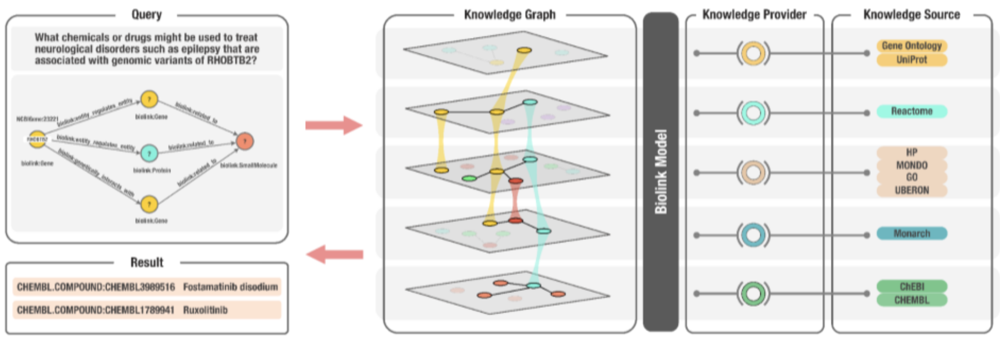

### How do I map my data source's components to Biolink Model? 

The diversity of both content and technical distribution of biological data can be overwhelming.  Sometimes the 
hardest part of using a shared model, is the art and science of mapping an existing concept to that model.  
Biolink Model is not an exception to this rule, but it does provide more metadata about each element in the model
to help guide this process.  Biolink Model classes and slots have descriptions, mappings, and class have 
expected id_prefixes for identifiers that define an instance of that class. 

The [Biolink Model Toolkit](https://github.com/biolink/biolink-model-toolkit) (bmt) provides some very helpful functions
for programmatically interacting with the model.  For example, bmt can be used to find all the classes that have
a particular id_prefix, or all of the slots that have a particular range.  It can find all the classes mapped to an 
identifier from a certain ontology or namespace. 

Ultimately, the Biolink Modeling team is here to help.  Please submit a ticket to our repository or reach out
directly. We are happy to meet with you!

### What happens if I have a concept, property, or edge in a graph that is not in the Biolink Model?

The Biolink Modeling team welcomes all contributions to the model, including new classes, new slots, new mappings, etc.
Please submit a ticket to our [issue tracker](https://github.com/biolink/biolink-model/issues).  We also welcome
pull requests (PRs)!  In general, an issue or a PR will be addressed faster by the modeling team by following these guidelines:

* All of our modeling and example data should be as clear as possible.
* Textual annotations on classes, slots and enumerations should be written with minimal jargon.  Of course, jargon
is hard to define. We encourage contributors to use their best judgement here, but expect that there are a wide
variety of people using and interacting with Biolink Model.  Our language here should be interpretable by people
with many different expertises.  Examples are the key to good PRs.
* Team members  adding new modeling bear the responsibility of re-using existing elements or demonstrating to the team 
how their proposed alternative modeling is generally superior. This can be simplified by keeping pull requests small. 
Diligent modeling efforts should be acknowledged, especially for newer contributors. A decision to not merge
in part of the work does not mean that the work isn’t appreciated or has been thrown away, as closed but unmerged pull 
requests could be revisited in the future.
   * LinkML provides micro-crediting metaslots. They can be used to acknowledge contributors outside of GitHub pull
request crediting and to time-stamp additions and changes.  They should be employed whenever possible, giving by default,
maximum credit to all parties that have significantly contributed to the model element.
      * https://linkml.io/linkml-model/latest/docs/contributors/
      * https://linkml.io/linkml-model/latest/docs/created_by/
      * https://linkml.io/linkml-model/latest/docs/created_on/
      * https://linkml.io/linkml-model/latest/docs/modified_by/ 
      * https://linkml.io/linkml-model/latest/docs/last_updated_on/

### What is the difference between `predicate` and `category`?

- `predicate` is an association slot and must have a value from the [`related to` hierarchy](https://biolink.github.io/biolink-model/related_to)
- `category` (or `rdf:type`) is a slot and must have a value from the [`named thing`](https://biolink.github.io/biolink-model/NamedThing)
or the [`association`](https://biolink.github.io/biolink-model/Association) hierarchy.

### What are some examples of Biolink Model usage?

The [NCATS Biomedical Translator Consortium](https://ncats.nih.gov/translator) has adopted Biolink Model as an open-source upper-level 
data model that supports semantic harmonization and reasoning across diverse Translator ‘knowledge sources’. 
The model serves a central role in the Translator program and forms the architectural basis of the Translator system, 
as described below. 

The Translator program aims to develop a comprehensive, relational, N-dimensional infrastructure designed to integrate disparate data 
sources—including objective signs and symptoms of disease, drug effects, chemical and genetic interactions, cell and organ pathology, 
and other relevant biological entities and relations—and reason over the integrated data to rapidly derive biomedical insights. 
The ultimate goal of Translator is to augment human reasoning and thereby accelerate translational science and knowledge discovery. 

To achieve its ambitious goal, the Translator project assembled a diverse interdisciplinary team and a variety of biomedical data 
sources, including electronic health record data, clinical trial data, genomic and other -omics data, chemical reaction data, and 
drug data. There are hundreds of data sources in the Translator ecosystem, each of which had its own data representation and were 
in formats that were not compatible or interoperable. Moreover, groups within the Translator Consortium had integrated the data 
sources as knowledge sources within independent KGs, but these KGs were developed using different technologies and formalisms 
such as property graphs in Neo4j and semantically-linked data via RDF and OWL. 

In order to interoperate between knowledge sources and reason across KGs, Biolink Model was adopted as the common dialect, thus 
enabling queries over the entire Translator KG ecosystem. The result was a federated, harmonized ecosystem that supports advanced 
reasoning and inference to derive biomedical insights based on user queries.

An example Translator use case involved a collaboration with investigators at the Hugh Kaul Precision Medicine Institute (PMI) at 
the University of Alabama at Birmingham. PMI investigators posed the following natural-language question to the Translator Consortium: 
what chemicals or drugs might be used to treat neurological disorders such as epilepsy that are associated with genomic 
variants of RHOBTB2? The investigators noted that RHOBTB2 variants cause an accumulation of RHOBTB2 protein and that this 
accumulation is believed to be the cause of the neurological disorder. 

To answer the PMI investigator’s question, Translator team members structured the following query: 
> NCBIGene:23221 (CURIE for RHOBTB2) -> [biolink:regulates, biolink:genetically_interacts_with] -> biolink:Protein, 
biolink:Gene -> [biolink:related_to] -> biolink:SmallMolecule

(see Figure 2 below). Because of the hierarchical structure of the Biolink model,
the use of biolink:related_to also will return more specific predicates such as biolink:regulates and biolink:affects. 
The objective was to identify drugs or chemicals that might regulate RHOBTB2 in some manner and thereby reduce the variant-induced 
accumulation of RHOBTB2 and associated neurological symptoms. As all nodes and edges within the Translator KG ecosystem are 
annotated to Biolink Model classes and attributes, a Translator query can be constructed from a natural-language user question 
and return results across a multitude of independent data sources. In addition, because the model employs hierarchical classes, 
with inheritance and polymorphism, natural-language queries translated to graph queries using Biolink Model syntax can be 
constructed at varying levels of granularity and return results from all levels of the hierarchy. Finally, because Biolink 
Model provides attributes on both edges and nodes that record provenance and evidence for these knowledge statements, each 
result is annotated with the trail of evidence that supports it.

When Translator team members sent the query to the Translator system, it returned several candidates of interest to PMI investigators, 
including fostamatinib disodium (CHEMBL.COMPOUND:CHEMBL3989516) and ruxolitinib (CHEMBL.COMPOUND:CHEMBL1789941). 
A review of the supporting evidence provided by Translator indicates that these are approved drugs that either directly or 
indirectly reduce or otherwise regulate the expression of RHOBTB2. Thus, Biolink Model helped Translator teams bring data 
together into a single system, thereby reducing the burden on the user to find and manually assemble data from these independent resources 
(see citation below).

Figure 2. An overview of the Translator architecture that supports biomedical KG-based question-answering, including the 
role of Biolink Model, in the context of an example question. In this example, a user has posed the natural-language question: 
what chemicals or drugs might be used to treat neurological disorders such as epilepsy that are associated with genomic variants of 
RHOBTB2? The question is translated into a graph query, as shown in the top left panel, which is then translated into a 
Translator standard machine query (not shown). The KG shown in the second panel from the left is derived from a variety
of diverse ‘knowledge sources’, a subset of which are displayed in the figure, that are exposed by Translator ‘knowledge providers’. 
Biolink Model provides standardization and semantic harmonization across the disparate knowledge sources, thereby allowing 
them to be integrated into a KG capable of supporting question-answering. In this example, Translator provided two answers or 
results of interest to the investigative team that posed the question, namely, fostamatinib disodium and ruxolitinib, as shown 
in the bottom left panel. 

###### Citing Biolink Model
Unni DR, Moxon SAT, Bada M, Brush M, Bruskiewich R, Caufield JH, Clemons PA, Dancik V, Dumontier M, Fecho K, Glusman G, 
Hadlock JJ, Harris NL, Joshi A, Putman T, Qin G, Ramsey SA, Shefchek KA, Solbrig H, Soman K, Thessen AE, Haendel MA, 
Bizon C, Mungall CJ, The Biomedical Data Translator Consortium (2022).
Biolink Model: A universal schema for knowledge graphs in clinical, biomedical, and translational science. Clin Transl Sci. Wiley; 2022 Jun 6; [https://onlinelibrary.wiley.com/doi/10.1111/cts.13302](https://onlinelibrary.wiley.com/doi/10.1111/cts.13302)
