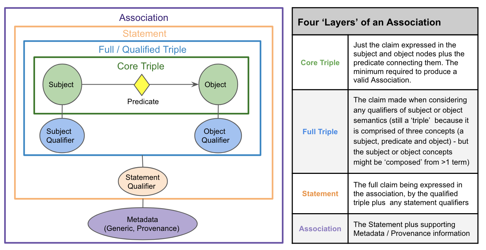
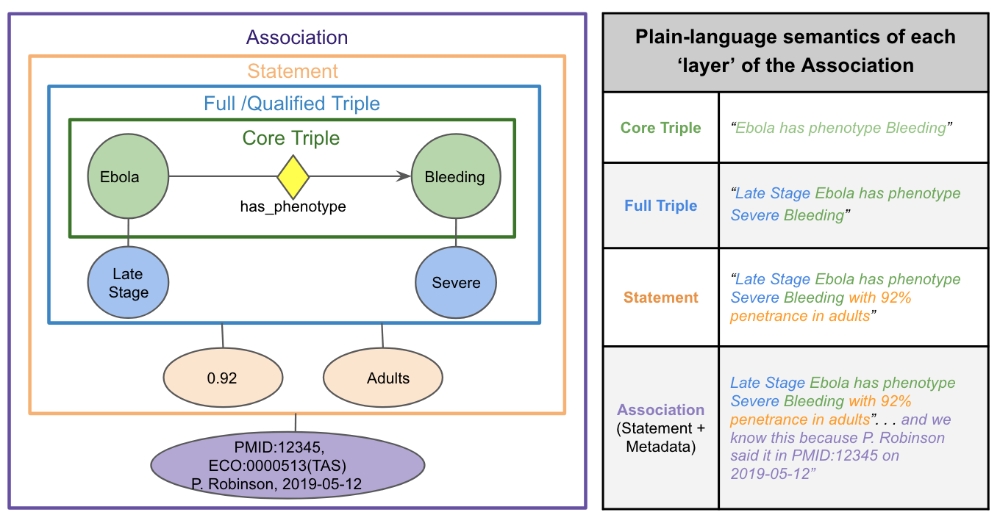

# Understanding the Biolink Model

Biolink Model is a high-level data model built to provide a schema for representing biological and biomedical knowledge. 
The model itself is agnostic to the graph formalism used to represent knowledge. i.e. You can use Biolink Model as a 
schema for labelled property graphs (Neo4j) or for edge labelled graphs (RDF). 

Biolink Model was built with the following aims:
* Bridge between labelled property graphs and edge labelled graphs
* Formal representation where the semantics are well defined within the model
* Focus on the actual schema and its semantics instead of being weighed down by limitations of a technology
* Extensible, self-documenting, and unambiguous
* Maps to external ontologies, thesauri, controlled vocabularies, and taxonomies

To that end, Biolink Model makes use of [LinkML](https://linkml.github.io/linkml) (the inked open data modeling 
framework) for defining the various semantics of the model.

## Understanding the Biolink Modeling Language

LinkML is a general purpose modeling language that follows object-oriented and ontological principles. The modeling 
language inherits features from the Web Ontology Language (OWL) and thus is capable of representing semantics in 
addition to the standard object-oriented hierarchy of a data model.

Models are authored in YAML and using linkML, JSON-Schema, OWL, RDF, Python data classes, Shape Expressions, and 
Markdown docs are also generated.

The modeling language provides the following idioms,
- **Class definition** : Used to define classes
- **Slot definition** : Used to define class properties
- **Type definition** : Used to define data types
- **Schema definition** : Used to define properties of the model itself

Refer to [linkML on GitHub](https://github.com/linkml) for a more detailed guide on LinkML.

## Structure of the Model

Biolink Model is a high-level data model where entities, associations, and predicates are arranged in a hierarchy. 
The model also defines node properties, edge properties, and types.

The model itself is organized using linkML Class definition (class), Slot definition (slot), Type definition (type) 
and Schema definition.

#### Conventions

In [Biolink Model YAML](biolink_model.yaml) any class, slot, or type is defined in `sentence case` form. When this model is compiled
to various forms (like JSON-Schema, OWL, Markdown) the representation is based on the following convention, 
- classes are named in `CamelCase` form
- slots are named in `snake_case` form
- types are named in `snake_case` form

At a glance the structure is as follows,
- [Classes](#classes)
  - [Entities](#Named-Things)
  - [Associations](#associations)
  - [Mixins](#mixins)
- [Slots](#slots)
  - [Predicates](#predicates)
  - [Node Properties](#node-properties)
  - [Edge Properties](#edge-properties)
- [Types](#types)

### Classes

A class represents an entity or an association. A class can have one more slots (properties).

In RDF sense, a class is basically `rdfs:Class`.

Within the Biolink Model there are two hierarchies of classes:
  - [Named Things](#named-things)
  - [Associations](#associations)

where Named Things are disjoint from Associations.

But they do share a common ancestor class: `entity`

##### Named Things

Named Things are classes that represent real world entities such as genes, diseases, chemical substances, etc. In a 
graph serialization, 'Named Things' are represented by nodes in a graph. Each class in the `named thing` has one or 
more slots (properties). The root of the "Named Things" hierarchy is the `biolink:NamedThing` class.

##### Associations

Associations are classes that represent an assertion or statement.  In RDF sense, an association is an `rdf:Statement`.
In a graph formalism, associations are represented using edges in a graph.

Associations help us to make assertions about the world. For example, we can say that a gene is associated with a disease. 
Or we can say that a gene is a member of a pathway.  Associations also help us constrain the meaning of an edge, or 
add context to the edge that describes how or when the edge takes place.  In fact, we also use association objects
to hold references to the publications, confidence scores, and other metadata that we use to support our assertions.

Associations are arranged in a hierarchy where the root of all Associations is the `association` class.  In general, 
Associations have three main properties (or slots):
  * `subject`: the subject of the association
  * `predicate`: the predicate or relationship between the subject and the object of the association
  * `object`: the object of the association
These three properties (or slots) define what Biolink calls a "core triple".

Subjects and objects are always classes in the Biolink Model that are descendants of "biolink:NamedThing" and 
represent core biological, chemical, and biomedical concepts (e.g. genes, diseases, chemicals, phenotypes), 
whose IRIs come from community standard ontologies (e.g. HGNC, MONDO, ChEBI, HPO).  As a best practice, 
Biolink Model prioritizes connectivity and practicality. 

The predicate in an Association is always a Biolink property (or slot) that is or descends from the "biolink:related_to" 
property.  Predicates in Biolink often are exactly equivalent to relations in the Relations Ontology.  

To express more complex or nuanced Statements, we use additional slots called qualifiers that  refine or extend the 
meaning of the core triple. At the highest level we distinguish two kinds of qualifiers: (1) node qualifiers altering 
the meaning of the Association subject or object specifically; (2) statement qualifiers refine or extend the meaning 
of the statement as a whole. 

Together, the subject, predicate, object, and optional qualifier(s) comprise the full semantics of the statement that 
an Association puts forth as true (i.e. its ‘S-P-O-Q’ semantics).  Association objects may also include slots to 
hold additional metadata about this core statement - primarily information about the provenance and evidence supporting it. 
Using these elements together we can build Associations with many possible ‘layers’ of complexity (Figure 1). 
Some Associations may simply consist of an S-P-O triple. Others may represent more complex statements that employ 
multiple qualifiers, supported by rich evidence and provenance metadata. For example, Figure 2 provides a layered 
view of a complex Disease to Phenotype Association instance. 

Figure 1: A layered view of a simple a Biolink Association object.
)

Figure 2: An Association representing the Statement that “Late Stage Ebola has phenotype Severe Bleeding with 92%  
penetrance in adults”, and some provenance metadata supporting this. This representation leans heavily on qualifiers 
for representing Statement semantics. 

At the highest level we distinguish two kinds of qualifiers that contribute to an Association Statement: 
* node qualifiers (aka subject / object qualifiers) extend or refine the meaning of an Association subject or object concept;
* statement qualifiers refine or extend the meaning of the core S-P-O triple as a whole.

Together, the subject, predicate, object, and optional qualifier(s) comprise the full semantics of the statement that an 
Association puts forth as true (i.e. its ‘S-P-O-Q’ semantics).  Association objects may also include slots to hold 
Metadata about this core statement - primarily information about the provenance and evidence supporting it - but unlike 
qualifiers, this metadata does not contribute to the meaning of the core Statement itself. 
Using these qualifier and metadata elements together, we can build Associations with many possible ‘layers’ of complexity.

Sometimes, seeing several examples of a modeling pattern is most helpful in applying the pattern to your own data.
To peruse our examples, please visit: [Association Examples With Qualifiers](association-examples-with-qualifiers.md)

Please refer to [Curating the Model](curating-the-model.md) for more information about making new Associations or 
making changes to existing Associations.

##### Mixins

Mixins are defined as a way of encouraging reuse of specific slots (properties) while ensuring a clear inheritance chain.
Mixins are used to extend the properties (or slots) of a class, without changing its
position in the class hierarchy.  Mixins can be extremely helpful in a number of ways: 
* to generalize a set of attributes that can apply to classes in different parts of the class hierarchy,
* reduce duplication of shared attributes between classes that do not inherit from one another
* to prevent the sometimes confusing nature of multiple inheritance noted in the '[diamond problem]'(https://tinyurl.com/4zdw9tsb).

In general, while mixin slots and classes should not be directly instantiated, or used directly as a slot in a class,
KGs can use them as a substitute for multiple inheritance. For example, a KG might wish to determine what are the parents
of a certain class.  In this case, the KG should navigate a mixin used in a domain or range of a class or slot, as it 
would the "is_a" demarcation.  

### Slots

In Biolink Model, slots represent properties that a class or an association can have.

A slot is similar to `rdf:Property` where it can link:
  * an instance of a class to another instance of a class
  * an instance of a class to a literal/data type

In Biolink Model slots are used to represent
  - [Predicates](#predicates)
  - [Node Properties](#node-properties)
  - [Edge Properties](#edge-properties) (aka Association Properties, subject/object/statement qualifiers)

#### Predicates

In a graph formalism, predicates are relationships that link two instances. In an OWL sense, predicates are 
similar to `owl:ObjectProperty`. For example, a predicate `biolink:treats` can be used to link an instance of class 
`biolink:ChemicalEntity` with an instance of class `Biolink:Disease`.

#### Node Properties

Node properties are slots that an entity class (i.e, a node) can have. The root of all node properties 
is `biolink:node_property` slot. In an OWL sense, node properties are similar to `owl:DataTypeProperty`.

For example, `biolink:symbol`, `biolink:synonym`, and `biolink:xref` are children of the `biolink:node_property` slot, 
and they are assigned to the entity class `named thing`. So all instances of this class can have `biolink:symbol`, 
`biolink:synonym`, and `biolink:xref` as properties that further describes the instance. 

#### Edge Properties

Edge properties are slots that an association class (i.e., an edge) can have. The root of all edge properties 
is `association slot` slot. In an OWL sense, edge properties are similar to `owl:DataTypeProperty`.

For example, `biolink:subject`, `biolink:predicate`, and `biolink:object` are children of the `biolink:association_slot` slot, 
and they are assigned to association class `biolink:association`. So all instances of this class can 
have `biolink:subject`, `biolink:predicate`, and `biolink:object` as its properties that further describes the instance.

### Types

linkML provides a handful of inbuilt data types. But you can also define custom data types using the modeling language.

In Biolink Model we have several data types.

* string
* integer
* uriorcurie
* float
* boolean
* iri type

Data types are not arranged in any hierarchy.

